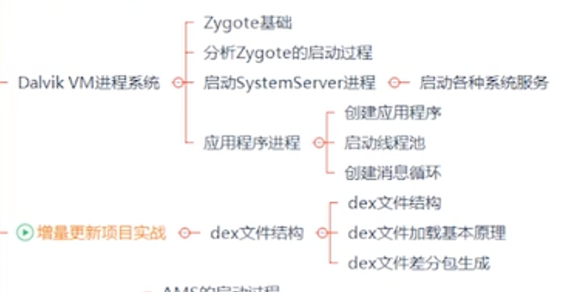
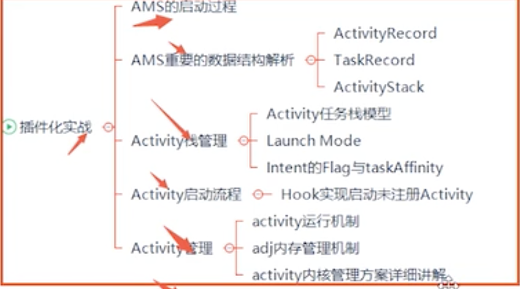

要有个前言，都知道ActivityManagerService是系统的引导服务，应用程序的启动、切换、调度和四大组件的启动和管理都需要AMS的支持，也可以看出其在Android中的重要性了。今天的故事就要从其启动流程开始讲起，虽然过程是有点枯燥的。

## 1. AMS启动过程

它是从`SystemServer`的`main`方法中开始的。

```java
//zygote 的主要入口点 
public static void main(String[] args) {
        new SystemServer().run();
    }
```

在`run`方法中依次调用了`startBootstrapServices`、`startCoreServices`、`startOtherServices`。

```java
private void run() {
    ......
      //开启服务
      try {
            t.traceBegin("StartServices");
        //SystemmSeriveManager启动了AMS、PowerMS、PackageMS等服务
            startBootstrapServices(t);
        //启动了DropBoxMangerService、BatteryService、ussageStatesService和WebViewUpdateServie
            startCoreServices(t);
        //启动了CamerService、AlarmManagerService、VrManagerService等服务
            startOtherServices(t);
        } catch (Throwable ex) {
            Slog.e("System", "******************************************");
            Slog.e("System", "************ Failure starting system services", ex);
            throw ex;
        } finally {
            t.traceEnd(); // StartServices
        }
    ...... 
}
```

可以看出官方把这些服务分为三大类，分别是`引导服务`、`核心服务`和`其他服务`。我们现在的主要任务还是先了解AMS是如何启动的，下面我们就要从`startBootstrapServices`方法这里开始捋一捋AMS启动过程了。

```java
###SystemServer
  private void startBootstrapServices(@NonNull TimingsTraceAndSlog t) {
  ......
    //ATMS初始化
        ActivityTaskManagerService atm = mSystemServiceManager.startService(
                ActivityTaskManagerService.Lifecycle.class).getService();
  //AMS初始化
        mActivityManagerService = ActivityManagerService.Lifecycle.startService(
                mSystemServiceManager, atm);
  //设置AMS的系统服务管理器
        mActivityManagerService.setSystemServiceManager(mSystemServiceManager);
  //设置AMS的应用管理器
        mActivityManagerService.setInstaller(installer);
        mWindowManagerGlobalLock = atm.getGlobalLock();
  ......	
}
```

### 1.1 ATMS初始化

ATMS主要通过`mSystemServiceManager.startService`初始化。**(在Android10.0之后AMS的工作已经被ATMS接管了。)**

在这个方法中传入了ActivityTaskManagerService.Lifecycle.class，而这个Service对象又是什么？它是ActivityTaskmanagerService的内部类：

```java
###ActivityTaskmanagerService
  public static final class Lifecycle extends SystemService {
        private final ActivityTaskManagerService mService;

        public Lifecycle(Context context) {
            super(context);
          // 创建 ATMS
            mService = new ActivityTaskManagerService(context);
        }

        @Override
        public void onStart() {
           // 发布 ATMS 到 ServiceManager
            publishBinderService(Context.ACTIVITY_TASK_SERVICE, mService);
            mService.start();
        }

    ......

        public ActivityTaskManagerService getService() {
            return mService;
        }
    }
```

可以看到在Lifecycle的构造方法中创建了ATMS实例进行了初始化：

```java
 public ActivityTaskManagerService(Context context) {
   // AMS 上下文
        mContext = context;
        mFactoryTest = FactoryTest.getMode();
   // ActivityThread 对象
        mSystemThread = ActivityThread.currentActivityThread();
   // ContextImpl 对象
        mUiContext = mSystemThread.getSystemUiContext();
        mLifecycleManager = new ClientLifecycleManager();
        mInternal = new LocalService();
        GL_ES_VERSION = SystemProperties.getInt("ro.opengles.version", GL_ES_VERSION_UNDEFINED);
        mWindowOrganizerController = new WindowOrganizerController(this);
        mTaskOrganizerController = mWindowOrganizerController.mTaskOrganizerController;
    }
```

再回到`ActivityTaskManagerService.Lifecycle`里，看看里面的`onstart`和`getService`又在哪里被调用的。接着来看下`mSystemServiceManager`的`startService`方法:

```java
###SystemServieManager
   public void startService(@NonNull final SystemService service) {
        // Register it.
        mServices.add(service);
        // Start it.
        long time = SystemClock.elapsedRealtime();
        try {
          //这里传进的service的onStart方法被调用
            service.onStart();
        } catch (RuntimeException ex) {
            throw new RuntimeException("Failed to start service " + service.getClass().getName()
                    + ": onStart threw an exception", ex);
        }
        warnIfTooLong(SystemClock.elapsedRealtime() - time, service, "onStart");
}

###ActivityTaskManagerService.Lifecycle
  public void onStart() {
           // 发布 ATMS 到 ServiceManager
            publishBinderService(Context.ACTIVITY_TASK_SERVICE, mService);
            mService.start();
        }

###ActivityTaskManagerService
private void start() {
  // 将 ActivityTaskManagerInternal 添加到 LocalServices
        LocalServices.addService(ActivityTaskManagerInternal.class, mInternal);
    }
    
```

当调用`mSystemServiceManager`的`startService`方法实际上就是在调用`ActivityTaskManagerService.Lifecycle`的`onStart`方法，最终调用到了ATMS的start方法。

而`mSystemServiceManager.startService(
                ActivityTaskManagerService.Lifecycle.class).getService()`这个方法调用实际上得到的就是ATMS实例。

所以在这里主要做了:

1. 构建`ATMS`
2. 发布`ATMS`到`ServiceManager`
3. 将 `ActivityTaskManagerInternal` 添加到 `LocalServices` 中

### 1.2 AMS初始化

在启动完`ATMS`后会启动`AMS`:

```java
### SytemServer
private void startBootstrapServices() {
  ......
  mActivityManagerService = ActivityManagerService.Lifecycle.startService(
                mSystemServiceManager, atm);
}

### AcctivityManagerService
    public static final class Lifecycle extends SystemService {
        private final ActivityManagerService mService;
        private static ActivityTaskManagerService sAtm;

        public Lifecycle(Context context) {
            super(context);
            mService = new ActivityManagerService(context, sAtm);
        }

        public static ActivityManagerService startService(
                SystemServiceManager ssm, ActivityTaskManagerService atm) {
            sAtm = atm;
            return ssm.startService(ActivityManagerService.Lifecycle.class).getService();
        }

        @Override
        public void onStart() {
            mService.start();
        }

      	......

        public ActivityManagerService getService() {
            return mService;
        }
    }
```

AMS初始化还是原来的味道，我们直接进到里面看下AMS的的构造函数和`start`方法中做了什么操作。

**AMS的的构造函数**:

1. 初始化上下文、SystemThread、erviceThread

```java
    public ActivityManagerService(Context systemContext, ActivityTaskManagerService atm) {
       //AMS上下文
        mContext = systemContext;

        mFactoryTest = FactoryTest.getMode();
      //ActivityThread对象
        mSystemThread = ActivityThread.currentActivityThread();
      //ContextImpl
        mUiContext = mSystemThread.getSystemUiContext();

        Slog.i(TAG, "Memory class: " + ActivityManager.staticGetMemoryClass());

      //线程名为ActivityManager的前台线程，ServieThread继承于HandlerThread
        mHandlerThread = new ServiceThread(TAG,
                THREAD_PRIORITY_FOREGROUND, false /*allowIo*/);
        mHandlerThread.start();
        mHandler = new MainHandler(mHandlerThread.getLooper());
      // 创建名为 android.ui 的线程
        mUiHandler = mInjector.getUiHandler(this);
				......
    }
```

2. 构建BroadcastQueue


````java
public ActivityManagerService(Context systemContext, ActivityTaskManagerService atm){
  ......
    //前台广播，10s
     final BroadcastConstants foreConstants = new BroadcastConstants(
                Settings.Global.BROADCAST_FG_CONSTANTS);
        foreConstants.TIMEOUT = BROADCAST_FG_TIMEOUT;
		//后台广播,60s
        final BroadcastConstants backConstants = new BroadcastConstants(
                Settings.Global.BROADCAST_BG_CONSTANTS);
        backConstants.TIMEOUT = BROADCAST_BG_TIMEOUT;
  	//分流广播，60s
  final BroadcastConstants offloadConstants = new BroadcastConstants(
                Settings.Global.BROADCAST_OFFLOAD_CONSTANTS);
        offloadConstants.TIMEOUT = BROADCAST_BG_TIMEOUT;
        // by default, no "slow" policy in this queue
        offloadConstants.SLOW_TIME = Integer.MAX_VALUE;

        mEnableOffloadQueue = SystemProperties.getBoolean(
                "persist.device_config.activity_manager_native_boot.offload_queue_enabled", false);
			//前台广播队列
        mFgBroadcastQueue = new BroadcastQueue(this, mHandler,
                "foreground", foreConstants, false);
  		//后台广播队列
        mBgBroadcastQueue = new BroadcastQueue(this, mHandler,
                "background", backConstants, true);
  		//分流广播队列
        mOffloadBroadcastQueue = new BroadcastQueue(this, mHandler,
                "offload", offloadConstants, true);
        mBroadcastQueues[0] = mFgBroadcastQueue;
        mBroadcastQueues[1] = mBgBroadcastQueue;
        mBroadcastQueues[2] = mOffloadBroadcastQueue;
}
````

3. 构建ActivieService和ProviderMap

```java
public ActivityManagerService(Context systemContext, ActivityTaskManagerService atm){
 	//构建 ActiveServices 用于管理 ServiceRecord
		mServices = new ActiveServices(this);
  //构建 ProviderMap 用于管理 ContentProviderRecord
    mProviderMap = new ProviderMap(this);
}
```

4. 关联ATMS

```java
mActivityTaskManager = atm;
        mActivityTaskManager.initialize(mIntentFirewall, mPendingIntentController,
                DisplayThread.get().getLooper());
        mAtmInternal = LocalServices.getService(ActivityTaskManagerInternal.class);
```

再来看下`start`方法:

```java
private void start() {
  // 发布电池状态服务
  mBatteryStatsService.publish();
        mAppOpsService.publish();
        Slog.d("AppOps", "AppOpsService published");
  // 添加 ActivityManagerInternal 到 LocalService
        LocalServices.addService(ActivityManagerInternal.class, mInternal);
        mActivityTaskManager.onActivityManagerInternalAdded();
        mPendingIntentController.onActivityManagerInternalAdded();
}
```

到这里AMS启动初始化也结束了。

初始化好了，就要来看下AMS的下一步动作，还是回到`SystemServer`中的`startBootstrapServices`方法里面。

**这里就不展开说了**

这里面依次调用了`mActivityManagerService.setSystemProcess()`，主要工作就是向ServiceManager注册关联的系统服务，它为`SystemServer`创建了一个`ProcessRecord`对象。

再调用了`mActivityManagerService.installSystemProviders()`，主要工作是为SystemServer加载SettingsProvider。

最后一步调用了`mActivityManagerService.systemReady()，`主要做了启动`System UI`和启动`Home Activiity`。

## 2. ATMS与ActivityTaskManager通信实现

在启动完之后，AMS主要的任务就是对运行中的Activity进行管理。这里我们还是来拿最熟悉的Activity的启动过程来引出接下去要讲的与AMS关联的几个关键类。

在Androoid8.0之后，对AMS进行了调整，那让我们看看又有哪方面的差别，这里以Android 11为源码进行讲解，从我们之前分析过的这篇[(Android11.0)App启动过程的深度挖掘(上篇)](https://juejin.cn/post/7034177835967184903)中了解到启动过程会调用`Instrumentation`的`execStartAcytivity`方法：

```java
public ActivityResult execStartActivity(
            Context who, IBinder contextThread, IBinder token, Activity target,
            Intent intent, int requestCode, Bundle options) {
        IApplicationThread whoThread = (IApplicationThread) contextThread;
        ......
          
   		 int result = ActivityTaskManager.getService().startActivity(whoThread,
                    who.getBasePackageName(), who.getAttributionTag(), intent,
                    intent.resolveTypeIfNeeded(who.getContentResolver()), token,
                    target != null ? target.mEmbeddedID : null, requestCode, 0, null, options);
    }


### ActivityTaskManager
public static IActivityTaskManager getService() {
        return IActivityTaskManagerSingleton.get();
    }

private static final Singleton<IActivityTaskManager> IActivityTaskManagerSingleton =
            new Singleton<IActivityTaskManager>() {
                @Override
                protected IActivityTaskManager create() {
                    final IBinder b = ServiceManager.getService(Context.ACTIVITY_TASK_SERVICE);
                    return IActivityTaskManager.Stub.asInterface(b);
                }
            };
```

这里调用了`ActivityTaskManager`的`getservice`方法，其实是调用了`IActivityTaskManagerSingleton`的getService方法，而它是个`Singletone`类，在这里可以看到得到名为`Context.ACTIVITY_TASK_SERVICE`的Service引用，也就是IBinder类型的AMS的引用。最后将它转换成了IActivtyManger的类型对象，这里采用了AIDL通信，而`IActivityManager.java`类是由AIDL工具在编译时自动生成的。

再来看下具体你的实现类：

```java
public class ActivityTaskManagerService extends IActivityTaskManager.Stub {
  ......
}
```

可以看到服务端也就是ATMS继承了`IActivityTaskManager.Stub`来实现相应的方法。采用AIDL这种方法也就不需要之前的代理类AMP了，所以在这之后代替它的是`IActivityTaskManager，也就是其本地代理。

放图:

在这里，ATMS只需要继承`IActivityTaskManager.Stub`类，就可以和`ActivityTaskManager`实现进程间通信了。

## 3. ATMS中的关联类

在分析启动过程的时候，经常会看到`ActivityRecord`、`ActivityStack`和`ActivityStarter`，那我们看下它们里面都做了些什么。

### 3.1 ActivityRecord

它内部记录了Activity的所有信息，因此它用来描述一个Activity，它是在启动Activity时被创建的，具体是在`ActivityStarter`的`startActivity`方法中被创建的。其中主要的成员变量：

| 名称                | 类型                       | 说明                                                         |
| ------------------- | -------------------------- | ------------------------------------------------------------ |
| mAtmService         | ActivityTaskManagerService | ATMS的已引用                                                 |
| info                | ActivityInfo               | Activity中代码和ANdroioodManifes设置的节点信息。如launchMoode |
| launchedFromPackage | String                     | 启动Activity的活动包                                         |
| taskAffinity        | String                     | Activity希望归属的栈                                         |
| task                | Task                       | 其中的任务                                                   |
| App                 | WindowProcessController    | 托管应用程序进程                                             |
| mState              | ActivityState              | 当前Activity的状态                                           |
| icon                | Int                        | Activity的图标资源标识符                                     |
| Theme               | Int                        | Activity的主题资源标识符                                     |

### 3.2 ActivityStack

ActivityStack是一个管理类，管理着所有Activity，内部维护了Activity的所有状态、特殊状态的Actvity和Activity以及相关的列表数据。ActivityStack又是由ActivityStackSupervisor来进行管理，而这个是在ATMS的`initialize`中被创建出来的。

```java
### ActivityTaskManagerService.java 
public void initialize(IntentFirewall intentFirewall, PendingIntentController intentController,
            Looper looper) {
        ......
        mStackSupervisor = createStackSupervisor();
   
 }

protected ActivityStackSupervisor createStackSupervisor() {
        final ActivityStackSupervisor supervisor = new ActivityStackSupervisor(this, mH.getLooper());
        supervisor.initialize();
        return supervisor;
    }
```

在ActivityStack中通过枚举值存储了Activity的所有状态：

```java
enum ActivityState {
        INITIALIZING,
        STARTED,
        RESUMED,
        PAUSING,
        PAUSED,
        STOPPING,
        STOPPED,
        FINISHING,
        DESTROYING,
        DESTROYED,
        RESTARTING_PROCESS
    }
```

看名称也能知道其大概意思，在Activity中还定义了一些特殊状态的Activity，不过其在父类Task中：

```java
ActivityRecord mPausingActivity = null;   //正在暂停的Activity
ActivityRecord mLastPausedActivity = null;  //上一个已经暂停的Activity
ActivityRecord mLastNoHistoryActivity = null; //最近一次没有历史记录的Activity
ActivityRecord mResumedActivity = null; //已经Resume的Activity

```

这些特殊的状态都是ActivityRecord类型的，ActivityRecord用来记录一个Activity的所有信息。

### 3.3 ActivityStarter

此类收集所有逻辑，用于确定应如何将意图和标志转换为活动以及相关的任务和堆栈。之前在Activity启动流程的时候讲过，在调用了`startActivity`方法时，会调用到`ActivityStarted`的`startActivityUnchecked`方法：

```java
### ActivitiyStarter.java
private int startActivityUnchecked(final ActivityRecord r, ActivityRecord sourceRecord,
                IVoiceInteractionSession voiceSession, IVoiceInteractor voiceInteractor,
                int startFlags, boolean doResume, ActivityOptions options, Task inTask,
                boolean restrictedBgActivity, NeededUriGrants intentGrants) {
        int result = START_CANCELED;
        final ActivityStack startedActivityStack;
        try {
            mService.deferWindowLayout();
            Trace.traceBegin(Trace.TRACE_TAG_WINDOW_MANAGER, "startActivityInner");
            result = startActivityInner(r, sourceRecord, voiceSession, voiceInteractor,
                    startFlags, doResume, options, inTask, restrictedBgActivity, intentGrants);
        } finally {
            Trace.traceEnd(Trace.TRACE_TAG_WINDOW_MANAGER);
            startedActivityStack = handleStartResult(r, result);
            mService.continueWindowLayout();
        }

        postStartActivityProcessing(r, result, startedActivityStack);

        return result;
    }

//启动活动并确定活动是否应添加到现有任务的顶部或向现有活动传递新意图。
//还将活动任务操作到请求的或有效的堆栈显示上
int startActivityInner(final ActivityRecord r, ActivityRecord sourceRecord,
            IVoiceInteractionSession voiceSession, IVoiceInteractor voiceInteractor,
            int startFlags, boolean doResume, ActivityOptions options, Task inTask,
            boolean restrictedBgActivity, NeededUriGrants intentGrants) {
        setInitialState(r, options, inTask, doResume, startFlags, sourceRecord, voiceSession,
                voiceInteractor, restrictedBgActivity);

        computeLaunchingTaskFlags();

        computeSourceStack();
  
  			mIntent.setFlags(mLaunchFlags);
			......
}
```

- 在`setInitialState`方法里，做了初始化启动Activity的各种配置，在初始化前会重置好各种配置，这些配置包括：ActivityRecord、Intent、TaskRecord和LaunchFlags（启动的FLAG）等等。

- 在`computeLaunchingTaskFlags`方法里，主要用于计算出启动的FLAG，并将计算的值赋值给你mLaunching。
- 在`computeSourceStack`方法里，将mLaunchFlags设置给Intent，达到设定Activity的启动方式的目的。

## 最后

不知不觉也讲了这么多，是不是对AMS也有了略微的了解。学了这篇之后，可以再来看下App的启动过程，会有事半功倍的效果。

**参考**

[[深入理解Android卷二 全文-第六章]深入理解ActivityManagerService](https://blog.csdn.net/innost/article/details/47254381)

[Android解析ActivityManagerService（一）AMS启动流程和AMS家族](http://liuwangshu.cn/framework/ams/1-ams.html)

《Android进阶解密》

[“无处不在” 的系统核心服务 —— ActivityManagerService 启动流程解析](https://juejin.cn/post/6844903981773225998)


inflate加载view过程

AMS是如何启动的

AMS如何与应用进程交互

如何理解startActiviity启动流程

我们如何应用*AMS*的核心原理

AMS如何通过handle跨进程

内存共享机制是如何完成handle跨进程



