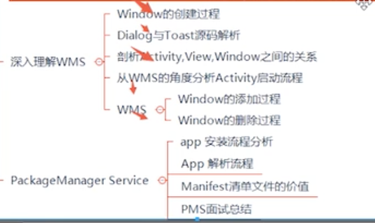

前文已经介绍过WindowManager，今天就让我们来认识下WindowManager的管理者WMS，在Android系统中，对系统中的所有窗口进行管理是窗口管理服务WindowManagerServices的职责。

可以知道App从启动到主窗口显示出来，主要需要`App`、`ActivityManagerService`、`WindowManagerService`和`SurfaceFlinger`等这几个模块相互合作。在这几个中App主要负责业务逻辑，绘制视图，AMS负责管理组件和进程信息以及堆栈信息，WMS负责管理Activity的窗口以及子窗口和系统窗口，SF则是在用于管理图形缓冲区，进行屏幕渲染。本文分析就基于Android 10.0上。

## 一、WMS的诞生

正如AMS一样，WMS也是在`SystemServer`的`main()`中诞生：

```java
public static void main(String[] args) {
        new SystemServer().run();
    }

private void run() {
  ......
  // 开启服务.
        try {
            traceBeginAndSlog("StartServices");
            startBootstrapServices();
            startCoreServices();
            startOtherServices();
            SystemServerInitThreadPool.shutdown();
        } catch (Throwable ex) {
            Slog.e("System", "******************************************");
            Slog.e("System", "************ Failure starting system services", ex);
            throw ex;
        } finally {
            traceEnd();
        }
  ......
}
```

从上面可以看出，创建了个SystemServer对象后就会调用run方法。在方法里会开启三种类型的系统服务，分别是引导服务，核心服务和其他服务，而WMS是其他服务的一种。

接着我们来看下WMS在startOtherService中是如何产生的：

```java
private void startOtherServices() {
 ......
  //代码1
  wm = WindowManagerService.main(context, inputManager, !mFirstBoot, mOnlyCore,
                    new PhoneWindowManager(), mActivityManagerService.mActivityTaskManager);
  ServiceManager.addService(Context.WINDOW_SERVICE, wm, /* allowIsolated= */ false,
                    DUMP_FLAG_PRIORITY_CRITICAL | DUMP_FLAG_PROTO);
  ServiceManager.addService(Context.INPUT_SERVICE, inputManager,
                    /* allowIsolated= */ false, DUMP_FLAG_PRIORITY_CRITICAL);
    traceEnd();

    traceBeginAndSlog("SetWindowManagerService");
  //代码2
    mActivityManagerService.setWindowManager(wm);
    traceEnd();

    traceBeginAndSlog("WindowManagerServiceOnInitReady");
  //代码3
            wm.onInitReady();
  ......
    //代码4
    try {
            wm.displayReady();
        } catch (Throwable e) {
            reportWtf("making display ready", e);
        }
  ......
    //代码5
    try {
            wm.systemReady();
        } catch (Throwable e) {
            reportWtf("making Window Manager Service ready", e);
        }
}

```

在代码1处，调用`WindowManagerServiice.main()`创建wms对象，并将该对象加入到`ServiceManager`中，代码2处，为AMS设置了wms，之后在代码3和代码4中初始化显示信息，在代码5处红藕你过来痛殴感知wms，系统的初始化已经完成，内部会调用`mPolicy.systemReady`方法。

从上面可以看到当调用了wms的main方法的时候，会创建wms实例出来：

```java
public static WindowManagerService main(final Context context, final InputManagerService im,
            final boolean showBootMsgs, final boolean onlyCore, WindowManagerPolicy policy,
            ActivityTaskManagerService atm) {
        return main(context, im, showBootMsgs, onlyCore, policy, atm,
                SurfaceControl.Transaction::new);
    }

 public static WindowManagerService main(final Context context, final InputManagerService im,
            final boolean showBootMsgs, final boolean onlyCore, WindowManagerPolicy policy,
            ActivityTaskManagerService atm, TransactionFactory transactionFactory) {
        DisplayThread.getHandler().runWithScissors(() ->
                sInstance = new WindowManagerService(context, im, showBootMsgs, onlyCore, policy,
                        atm, transactionFactory), 0);
        return sInstance;
    }
```

在`main`方法中，会用`DisplayThread.getHandle`的`runWithSciissors`方法，说明WMS的创建是运行在**android.display**线程中。**DisplayThread 线程是一个系统前台线程，用于执行一些延时要非常小的关于显示的操作**

在`Handle`的`runWithScissors`方法中:

```java
public final boolean runWithScissors(final Runnable r, long timeout) {
        ......

        if (Looper.myLooper() == mLooper) {
            r.run();
            return true;
        }

        BlockingRunnable br = new BlockingRunnable(r);
        return br.postAndWait(this, timeout);
    }
```

在这里会判断是否是当前的looper，这里的looper也是指是不是处在**android.display**中。当如果不是的时候，就会将runnable传入到`BlockingRunnable，`并执行`postAndWait`方法。

```java
    private static final class BlockingRunnable implements Runnable {
        private final Runnable mTask;
        private boolean mDone;

        public BlockingRunnable(Runnable task) {
            mTask = task;
        }

        @Override
        public void run() {
            try {
                mTask.run();
            } finally {
                synchronized (this) {
                    mDone = true;
                    notifyAll();
                }
            }
        }

        public boolean postAndWait(Handler handler, long timeout) {
            if (!handler.post(this)) {
                return false;
            }

            synchronized (this) {
                if (timeout > 0) {
                    final long expirationTime = SystemClock.uptimeMillis() + timeout;
                    while (!mDone) {
                        long delay = expirationTime - SystemClock.uptimeMillis();
                        if (delay <= 0) {
                            return false; // timeout
                        }
                        try {
                            wait(delay);
                        } catch (InterruptedException ex) {
                        }
                    }
                } else {
                    while (!mDone) {
                        try {
                            wait();
                        } catch (InterruptedException ex) {
                        }
                    }
                }
            }
            return true;
        }
    }
}
```

在`postAndWait`方法里，在`mDone`没有设置为trrue时，一直会让线程处于等待状态，直到run方法被执行。在这个时候会设置爱mDone为true，并同时`notifyAll`唤醒线程。从这里也可以看出wms的创建的优先级会高点。

接着就会执行到wms的构造方法，构造方法很长我们就截取一些关键点：

```java
private WindowManagerService(Context context, InputManagerService inputManager,
            boolean showBootMsgs, boolean onlyCore, WindowManagerPolicy policy,
            ActivityTaskManagerService atm, TransactionFactory transactionFactory) {
  			......   
        //代码1
  			mPolicy = policy;
  
  			//代码2
        mAnimator = new WindowAnimator(this);
        mRoot = new RootWindowContainer(this);

        mWindowPlacerLocked = new WindowSurfacePlacer(this);
        mTaskSnapshotController = new TaskSnapshotController(this);

        mWindowTracing = WindowTracing.createDefaultAndStartLooper(this,
                Choreographer.getInstance());

        LocalServices.addService(WindowManagerPolicy.class, mPolicy);
  
  			......
  			//代码3
  		  mActivityManager = ActivityManager.getService();
        mActivityTaskManager = ActivityTaskManager.getService();
  
  
}
```

在代码1处，`mPolicy`对象在wms中占有了很重要的作用，是一个接口，WMS中的操作都是wmp所处理。而它真正的实现类是`PhoneWindowManager`，`PhoneWindowManager`处理线程是在`ui`线程中。

## 二、WMS重要成员

| 名字                          | 含义                                                         |
| ----------------------------- | ------------------------------------------------------------ |
| mPolicy: WiindoowMangerPolicy | 是窗口管理策略的接口类，用来定义一个窗口所要遵循的通用规范   |
| mSessions: ArraySet           | 主要用于进程间通信，其他的应用程序进程需要和WMS进程通信就需要经过Session，每个应用进程都会对应一个Session，保存它就是用来记录所有向WMS提出窗口管理服务的客户端。 |
| mWindowMap：WindowHashMap | key对应的值是IBinder，value对应的值是WindowState。Window则是在窗口管理中的一个窗口 |
| mAnimator：WindowAnimator | windowAnimatoor类型的变量，用于管理窗口的动画以及特效动画 |
| mH：H | 系统的Handler，用于将任务加入到主线程的消息队列中 |


## 三、WMS的添加过程

从上文`ViewRootImpl`在调用`setView`方法时会执行`addToDisplay`方法，内部又会调用了`WMS`的`addWindow`方法并将自身也就是`Session`传入了进去，我们直接来看下`WindowManagerService`的`addWindow`方法：

```java
 public int addWindow(Session session, IWindow client, int seq,
            LayoutParams attrs, int viewVisibility, int displayId, Rect outFrame,
            Rect outContentInsets, Rect outStableInsets, Rect outOutsets,
            DisplayCutout.ParcelableWrapper outDisplayCutout, InputChannel outInputChannel,
            InsetsState outInsetsState) {
       ......
   
         synchronized (mGlobalLock) {
         //WindowToken转换为专门针对应用程序窗口的AppWindowToken
            AppWindowToken atoken = null;
         //对子窗口使用现有的父窗口令牌，因为它们与父窗口具有相同的令牌，因此我们可以对它们应用相同的策略
         		WindowToken token = displayContent.getWindowToken(
                    hasParent ? parentWindow.mAttrs.token : attrs.token);
         
         //如果不存在token
         if (token == null) {
           //如果是Appliation类型的窗口,  不允许WindowToken为null
           if (rootType >= FIRST_APPLICATION_WINDOW && rootType <= LAST_APPLICATION_WINDOW) {
                    Slog.w(TAG_WM, "Attempted to add application window with unknown token "
                          + attrs.token + ".  Aborting.");
                    return WindowManagerGlobal.ADD_BAD_APP_TOKEN;
                }
           .......
         }
         
         //创建WindowState
          final WindowState win = new WindowState(this, session, client, token, parentWindow,
                    appOp[0], seq, attrs, viewVisibility, session.mUid,
                    session.mCanAddInternalSystemWindow);
         
         //创建InputChanel，用来Input信息的接收和传递
         final boolean openInputChannels = (outInputChannel != null
                    && (attrs.inputFeatures & INPUT_FEATURE_NO_INPUT_CHANNEL) == 0);
            if  (openInputChannels) {
                win.openInputChannel(outInputChannel);
            }
         
         //将WindowState加入到windowMap中
         		win.attach();
            mWindowMap.put(client.asBinder(), win);

            win.initAppOpsState();
         //将WindowState对象添加到WindowToken中，WindowToken将作为WindowState的父容器
         win.mToken.addWindow(win);
        .....
          //创建窗口动画
           final WindowStateAnimator winAnimator = win.mWinAnimator;
            winAnimator.mEnterAnimationPending = true;
            winAnimator.mEnteringAnimation = true;
         
         //如果能获取到焦点，则更新焦点窗口
         		boolean focusChanged = false;
            if (win.canReceiveKeys()) {
                focusChanged = updateFocusedWindowLocked(UPDATE_FOCUS_WILL_ASSIGN_LAYERS,
                        false /*updateInputWindows*/);
                if (focusChanged) {
                    imMayMove = false;
                }
            }
         
         //更新输入 Window
         if (focusChanged) {
                displayContent.getInputMonitor().setInputFocusLw(displayContent.mCurrentFocus,
                        false /*updateInputWindows*/);
            }
         
            displayContent.getInputMonitor().updateInputWindowsLw(false /*force*/);

            ......
              
					//如果方向有更新，则更新全局配置
            if (win.isVisibleOrAdding() && displayContent.updateOrientationFromAppTokens()) {
                reportNewConfig = true;
            }
         ......
       }
   
 }
```

在`addWindow`中做了大量的检查，主要做了如下工作：

1. 对所有窗口类型进行检查，不满足就不会去执行
2. 对`windowToken`迹进行处理，获取不到则会创建新的`WindowToken`
3. 创建`windowState`对象，并将其与WindowToken相关联，让WindowToken成为WindowStae对象的父容器
4. 更新焦点窗口以及更新`InputWindow`

### 3.1 WindowToken创建

​	WindowToken在里面的作用是作为WindowState的父容器，负责管理一组Window。而它的构造方法如下：

```java
WindowToken(WindowManagerService service, IBinder _token, int type, boolean persistOnEmpty,
            DisplayContent dc, boolean ownerCanManageAppTokens, boolean roundedCornerOverlay) {
        super(service);
  //赋值IBinder对象
        token = _token;
  //窗口类型
        windowType = type;  
  //是否是显式添加的WindowToken
        mPersistOnEmpty = persistOnEmpty;  
        mOwnerCanManageAppTokens = ownerCanManageAppTokens;
        mRoundedCornerOverlay = roundedCornerOverlay;
        onDisplayChanged(dc);
    }

void onDisplayChanged(DisplayContent dc) {
  //将该对象添加到DisplayContent中
        dc.reParentWindowToken(this);
        super.onDisplayChanged(dc);
    }
```

做了些属性初始化工作后，将`WindowToken`传递给了`DisplayContent`,最终把token保存到了`DisplayContent#mToken`中。

```java
//DisplayContent.java
void reParentWindowToken(WindowToken token) {
        final DisplayContent prevDc = token.getDisplayContent();
        if (prevDc == this) {
            return;
        }
        ......

        addWindowToken(token.token, token);
    }

private void addWindowToken(IBinder binder, WindowToken token) {
  // 如果该WindowToken已经关联有DisplayContent对象，则不能再关联其他DisplayContent对象
        final DisplayContent dc = mWmService.mRoot.getWindowTokenDisplay(token);
        if (dc != null) {
            // We currently don't support adding a window token to the display if the display
            // already has the binder mapped to another token. If there is a use case for supporting
            // this moving forward we will either need to merge the WindowTokens some how or have
            // the binder map to a list of window tokens.
            throw new IllegalArgumentException("Can't map token=" + token + " to display="
                    + getName() + " already mapped to display=" + dc + " tokens=" + dc.mTokenMap);
        }
        if (binder == null) {
            throw new IllegalArgumentException("Can't map token=" + token + " to display="
                    + getName() + " binder is null");
        }
        if (token == null) {
            throw new IllegalArgumentException("Can't map null token to display="
                    + getName() + " binder=" + binder);
        }

  //将WindowToken添加到哦DisplayContent的TokenMap中
        mTokenMap.put(binder, token);

  //对于不是Activity类型的窗口，会根据Window类型添加到对应三个container中国
        if (token.asAppWindowToken() == null) {
            switch (token.windowType) {
                case TYPE_WALLPAPER:
                    mBelowAppWindowsContainers.addChild(token);
                    break;
                case TYPE_INPUT_METHOD:
                case TYPE_INPUT_METHOD_DIALOG:
                    mImeWindowsContainers.addChild(token);
                    break;
                default:
                    mAboveAppWindowsContainers.addChild(token);
                    break;
            }
        }
    }
```

到这里WindowToken对象就创建完毕了。

### 3.2 WindowState创建

`WindowToken`管理着`windowState`，每个`WindowState`代表了一个具体的Window，每次添加个Window就会创建出对应的一个`windowState`，其构造方法如下：

```java
//WindowStae 
WindowState(WindowManagerService service, Session s, IWindow c, WindowToken token,
            WindowState parentWindow, int appOp, int seq, WindowManager.LayoutParams a,
            int viewVisibility, int ownerId, boolean ownerCanAddInternalSystemWindow,
            PowerManagerWrapper powerManagerWrapper) {
        super(service);
        mSession = s;
        mClient = c;
        mAppOp = appOp;
        mToken = token;
        mAppToken = mToken.asAppWindowToken();
       ......

        mWinAnimator = new WindowStateAnimator(this);
        mWinAnimator.mAlpha = a.alpha;

        mRequestedWidth = 0;
        mRequestedHeight = 0;
        mLastRequestedWidth = 0;
        mLastRequestedHeight = 0;
        mLayer = 0;
        mInputWindowHandle = new InputWindowHandle(
                mAppToken != null ? mAppToken.mInputApplicationHandle : null, c,
                    getDisplayId());
    }
```

其中创建了`WindowStateAnimator`，其实用来为WIndowState对象进行动画和Surface的转变相关操作，在绘制过程中，动画的状态和surface的状态都会由该对象进行记录。

**从addWindow方法我们得知WMS有3个重要的类分别是WindowToken、WindowState和DisplayContent**

## 四、小结

在WMS中，`WindowState`代表着一个窗口，`WIndowToken`作为`WIndowState`的父容器，管理着一组窗口。在通过addWindow方法后，就创建出了相对于`system_server`的窗口管理对象。

**参考**

[Android解析WindowManagerService（一）WMS的诞生](http://liuwangshu.cn/framework/wms/1-wms-produce.html)

[深入理解 WindowManagerService](https://www.jianshu.com/p/9e244d13b866?hmsr=toutiao.io)

[WMS—启动过程](http://gityuan.com/2017/01/08/windowmanger/)


