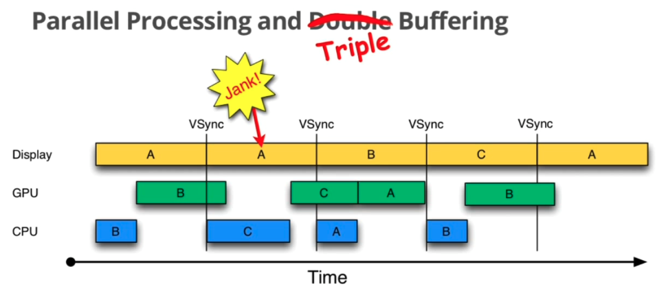

## 一. 渲染基本概念

对于渲染来说在开始前我们先了解几个概念：

CPU主要负责包括 `Measure`，`Layout`，`Record`，`Execute` 的计算操作。

GPU主要负责 `Rasterization`（栅格化）操作。栅格化是指将向量图形格式表示的图像转换成位图（像素）以用于显示设备输出的过程，简单来说就是将我们要显示的视图，转换成用像素来表示的格式。

帧率代表了GPU在一秒内绘制操作的帧数。

刷新率代表了屏幕在一秒内刷新屏幕的次数，Android手机一般为60HZ。

## 二. Android黄油计划

涉及到滑动流畅，Android在谷歌4.1版本引入了黄油计划。其中有三个重要的核心元素：`VSYNC`、缓存区和`Choreographer`:

### 2.1 VSYNC信号

在Android4.0的时候，CPU可能会因为在忙其他的事情，导致没来得及处理UI绘制。为了解决这个问题，设计成系统在收到VSYN信号后，才会开始下一帧的渲染。也就是收到VSYN通知，CPU和GPU才开始计算然后把数据写入buffer中。

VSYN信号是由屏幕产生的，并且以60fps的固定频率发送给Android系统，在Android系统中的`SurfaceFlinger`接收发送的Vsync信号。当屏幕从缓存区扫描完一帧到屏幕上之后，开始扫描下一帧之前，发出的一个同步信号，该信号用来切换前缓冲区和后缓冲区。

在引入了Vsyn信号之后，绘制就变成了：


可以看到渲染的时候从第0帧开始，CPU开始准备第一帧的图形处理，好了才交给GPU进行处理，再上一帧到来之后，CPU就会开始第二帧的处理，基本上跟Vsync的信号保持同步。

有了Vsync机制，可以让`CPU/GPU`有完整的16ms时间来处理数据，减少了jank。

### 2.2 三重缓存

在采用双缓冲机制的时候，也意味着有两个缓存区，分别是让绘制和显示器拥有各自的buffer，GPU使用Back Buffer进行一帧图像数据写入，显示器则是用Frame Buffer，一般来说CPU和GPU处理数据的速度视乎都能在16ms内完成，而且还有时间空余。但是一旦界面比较复杂的情况，CPU/GPU的处理时间超过了16ms，双缓冲开始失效了：


在第二个时间段内，因为GPU还是处理B帧，数据没有及时交换，导致继续系那是之前A缓存区中的内容。

在B帧完成之后，又因为缺少了Vusnc信号，只能等待一段时间。

直到下一个Vsync信号出现的时候，`CPU/GPU`才开始马上执行，由于执行时间仍然超过了16ms，导致下一次应该执行的缓存区交换又被推迟了，反复这种情形，就会出越来越多的jank。

为了解决这个问题，Android 4.1才引入了三缓冲机制：在双缓冲机制的基础上增加了一个`Graohic Buffer`缓冲区，这样就可以最大限度的利用空闲的时间。



可以看到在第二个时间段里有了区别，在第一次Vsync发生之后，CPU不用再等待了，它会使用第三个bufferC来进行下一帧的准备工作。整个过程就开始的时候卡顿了一下，后面还是很流畅的。但是GPU需要跨越两个Vsync信号才能显示，这样就还是会有一个延迟的现象。

**总的来说三缓冲有效利用了等待vysnc的时间,减少了jank，但是带来了lag。**

### 2.3 Choreographer

在了解了Vsync机制后，上层又是如何接受这个Vsync信号的？

Google为上层设计了一个`Choreographer`类，翻译成中文是“编舞者”，是希望通过它来控制上层的绘制（舞蹈）节奏。

可以直接从其构造函数开始看起：

```java
private Choreographer(Looper looper, int vsyncSource) {
  //创建Looper对象
        mLooper = looper;
  //接受处理消息
        mHandler = new FrameHandler(looper);
  //用来接受垂直同步脉冲，也就是Vsync信号
        mDisplayEventReceiver = USE_VSYNC
                ? new FrameDisplayEventReceiver(looper, vsyncSource)
                : null;
        mLastFrameTimeNanos = Long.MIN_VALUE;
//计算下一帧的时间，Androoid手机屏幕是60Hz的刷新频率
        mFrameIntervalNanos = (long)(1000000000 / getRefreshRate());
//初始化CallbackQueue，将在下一帧开始渲染时回调
        mCallbackQueues = new CallbackQueue[CALLBACK_LAST + 1];
        for (int i = 0; i <= CALLBACK_LAST; i++) {
            mCallbackQueues[i] = new CallbackQueue();
        }
        // b/68769804: For low FPS experiments.
        setFPSDivisor(SystemProperties.getInt(ThreadedRenderer.DEBUG_FPS_DIVISOR, 1));
    }
```

主要来看下`FrameHandler`和`FrameDisplayEventReceiver`的数据结构：

```java
private final class FrameHandler extends Handler {
        public FrameHandler(Looper looper) {
            super(looper);
        }

        @Override
        public void handleMessage(Message msg) {
            switch (msg.what) {
                //开始渲染下一帧的操作
                case MSG_DO_FRAME:
                    doFrame(System.nanoTime(), 0);
                    break;
                //请求Vsync信号
                case MSG_DO_SCHEDULE_VSYNC:
                    doScheduleVsync();
                    break;
                //请求执行Callback
                case MSG_DO_SCHEDULE_CALLBACK:
                    doScheduleCallback(msg.arg1);
                    break;
            }
        }
    }
```

在`FrameHandler`可以看到对三种消息进行了处理，对其具体实现一会分析。

```java
private final class FrameDisplayEventReceiver extends DisplayEventReceiver
            implements Runnable {
        private boolean mHavePendingVsync;
        private long mTimestampNanos;
        private int mFrame;

        public FrameDisplayEventReceiver(Looper looper, int vsyncSource) {
            super(looper, vsyncSource, CONFIG_CHANGED_EVENT_SUPPRESS);
        }
  
        @Override
        public void onVsync(long timestampNanos, long physicalDisplayId, int frame) {
            
            ......
            mTimestampNanos = timestampNanos;
            mFrame = frame;
          //将本身作为runnable传入msg， 发消息后 会走run()，即doFrame()，也是异步消息
            Message msg = Message.obtain(mHandler, this);
            msg.setAsynchronous(true);
            mHandler.sendMessageAtTime(msg, timestampNanos / TimeUtils.NANOS_PER_MS);
        }

        @Override
        public void run() {
            mHavePendingVsync = false;
            doFrame(mTimestampNanos, mFrame);
        }
    }
```

可以看出来这个类主要是用来接收底层的VSync信号开始处理UI过程。而Vsync信号是由SurfaceFlinger实现并定时发送，接收到之后就会调用onVsync方法，在里面进行处理消息发送到主线程处理，另外在run()方法里面执行了doFrame()，这也是接下来要关注的重点方法。

#### 2.3.1 Choreographer执行过程

> ViewRootImpl 中调用 Choreographer 的 postCallback 方法请求 Vsync 并传递一个任务（事件类型是 Choreographer.CALLBACK_TRAVERSAL）

最开始执行的是`postCallBack`发起回调，这个`FrameCallback`将会在下一帧渲染时执行。而其内部又调用了`postCallbackDelayed`方法，在其中又调用了`postCallbackDelayedInternal`方法：

```java
private void postCallbackDelayedInternal(int callbackType,
            Object action, Object token, long delayMillis) {
        ......
        synchronized (mLock) {
            final long now = SystemClock.uptimeMillis();
            final long dueTime = now + delayMillis;
            mCallbackQueues[callbackType].addCallbackLocked(dueTime, action, token);

            if (dueTime <= now) {
                scheduleFrameLocked(now);
            } else {
                Message msg = mHandler.obtainMessage(MSG_DO_SCHEDULE_CALLBACK, action);
                msg.arg1 = callbackType;
                msg.setAsynchronous(true);
                mHandler.sendMessageAtTime(msg, dueTime);
            }
        }
    }
```

在这里执行了时间的计算，如果立即就会调用`scheduleFrameLocked`方法，不然就会延迟发送一个`MSG_DO_SCHEDULE_CALLBACK`消息，并且在这里使用`msg.setAsynchronous(true)`讲消息设置成异步。、

而所对应的mHandle也就是之前的`FrameHandler`，根据消息类型`MSG_DO_SCHEDULE_CALLBACK`,最终会调用到`doScheduleCallback`方法：

```java
void doScheduleCallback(int callbackType) {
        synchronized (mLock) {
            if (!mFrameScheduled) {
                final long now = SystemClock.uptimeMillis();
                if (mCallbackQueues[callbackType].hasDueCallbacksLocked(now)) {
                    scheduleFrameLocked(now);
                }
            }
        }
    }
```

到了这一步看到还是会调用到`scheduleFrameLocked`方法。

```java
private void scheduleFrameLocked(long now) {
        if (!mFrameScheduled) {
            mFrameScheduled = true;
            if (USE_VSYNC) {
              //开启了Vsync
                if (DEBUG_FRAMES) {
                    Log.d(TAG, "Scheduling next frame on vsync.");
                }

                
                if (isRunningOnLooperThreadLocked()) {
                  //申请Vsync信号
                    scheduleVsyncLocked();
                } else {
                  //最终还是会调用到scheduleVsyncLocked方法
                    Message msg = mHandler.obtainMessage(MSG_DO_SCHEDULE_VSYNC);
                    msg.setAsynchronous(true);
                    mHandler.sendMessageAtFrontOfQueue(msg);
                }
            } else {
              //如果没有直接使用Vsync的话，则直接通过该消息执行doFrame
                final long nextFrameTime = Math.max(
                        mLastFrameTimeNanos / TimeUtils.NANOS_PER_MS + sFrameDelay, now);
                if (DEBUG_FRAMES) {
                    Log.d(TAG, "Scheduling next frame in " + (nextFrameTime - now) + " ms.");
                }
                Message msg = mHandler.obtainMessage(MSG_DO_FRAME);
                msg.setAsynchronous(true);
                mHandler.sendMessageAtTime(msg, nextFrameTime);
            }
        }
    }
```

在这里对是否使用Vsync信号进行处理，如果没有使用则直接通过消息执行doFrame。如果使用的就会先判断是否在当前Looper线程中运行，如果在的话就会请求Vsync信号,否则发送消息到 FrameHandler。直接来看下`scheduleVsyncLocked`方法：

```java
 private void scheduleVsyncLocked() {
        mDisplayEventReceiver.scheduleVsync();
    }
```

可以看到调用了`FrameDisplayEventReceiver`的`scheduleVsync`方法，通过查找在其父类`DisplayEventReceiver`中找到了`scheduleVsync`方法:

```java
public void scheduleVsync() {
        if (mReceiverPtr == 0) {
            Log.w(TAG, "Attempted to schedule a vertical sync pulse but the display event "
                    + "receiver has already been disposed.");
        } else {
          //申请VSYNC信号，会回调onVsunc方法
            nativeScheduleVsync(mReceiverPtr);
        }
    }
```

`scheduleVsync()`就是使用native方法`nativeScheduleVsync()`去申请VSYNC信号。等下一次信号接收后会调用`dispatchVsync` 方法:

```java
private void dispatchVsync(long timestampNanos, long physicalDisplayId, int frame) {
        onVsync(timestampNanos, physicalDisplayId, frame);
    }
```

这个onVsync方法最终实现也就是在`FrameDisplayEventReceiver`里。可以知道最终还是走到了`doFrame`方法里。

```java
void doFrame(long frameTimeNanos, int frame) {
        final long startNanos;
        synchronized (mLock) {
            if (!mFrameScheduled) {
                return; // no work to do
            }
           ......
					//设置当前frame的Vsync信号到来时间     
            long intendedFrameTimeNanos = frameTimeNanos;
            startNanos = System.nanoTime();
            final long jitterNanos = startNanos - frameTimeNanos;
            if (jitterNanos >= mFrameIntervalNanos) {
              //时间差大于一个时钟周期，认为跳frame    
                final long skippedFrames = jitterNanos / mFrameIntervalNanos;
              //跳frame数大于默认值，打印警告信息，默认值为30   
                if (skippedFrames >= SKIPPED_FRAME_WARNING_LIMIT) {
                    Log.i(TAG, "Skipped " + skippedFrames + " frames!  "
                            + "The application may be doing too much work on its main thread.");
                }
              //计算实际开始当前frame与时钟信号的偏差值  
                final long lastFrameOffset = jitterNanos % mFrameIntervalNanos;
                if (DEBUG_JANK) {
                    Log.d(TAG, "Missed vsync by " + (jitterNanos * 0.000001f) + " ms "
                            + "which is more than the frame interval of "
                            + (mFrameIntervalNanos * 0.000001f) + " ms!  "
                            + "Skipping " + skippedFrames + " frames and setting frame "
                            + "time to " + (lastFrameOffset * 0.000001f) + " ms in the past.");
                }
              
              //修正偏差值，忽略偏差，为了后续更好地同步工作 
                frameTimeNanos = startNanos - lastFrameOffset;
            }

          //若时间回溯，则不进行任何工作，等待下一个时钟信号的到来
            if (frameTimeNanos < mLastFrameTimeNanos) {
                if (DEBUG_JANK) {
                    Log.d(TAG, "Frame time appears to be going backwards.  May be due to a "
                            + "previously skipped frame.  Waiting for next vsync.");
                }
              //请求下一次时钟信号  
                scheduleVsyncLocked();
                return;
            }

            ......

           //记录当前frame信息    
            mFrameInfo.setVsync(intendedFrameTimeNanos, frameTimeNanos);
            mFrameScheduled = false;
           //记录上一次frame开始时间，修正后的  
            mLastFrameTimeNanos = frameTimeNanos;
        }

        try {
          //执行相关callBack   
            Trace.traceBegin(Trace.TRACE_TAG_VIEW, "Choreographer#doFrame");
            AnimationUtils.lockAnimationClock(frameTimeNanos / TimeUtils.NANOS_PER_MS);

            mFrameInfo.markInputHandlingStart();
            doCallbacks(Choreographer.CALLBACK_INPUT, frameTimeNanos);

            mFrameInfo.markAnimationsStart();
            doCallbacks(Choreographer.CALLBACK_ANIMATION, frameTimeNanos);
            doCallbacks(Choreographer.CALLBACK_INSETS_ANIMATION, frameTimeNanos);

            mFrameInfo.markPerformTraversalsStart();
            doCallbacks(Choreographer.CALLBACK_TRAVERSAL, frameTimeNanos);

            doCallbacks(Choreographer.CALLBACK_COMMIT, frameTimeNanos);
        } finally {
            AnimationUtils.unlockAnimationClock();
            Trace.traceEnd(Trace.TRACE_TAG_VIEW);
        }
    }
```

doFrame方法对当前帧的运行时间进行了一系列判断和修正，最终顺序执行了五种事件回调。

1. CALLBACK_INPUT：输入
2. CALLBACK_ANIMATION:动画
3. CALLBACK_INSETS_ANIMATION：插入更新的动画
4. CALLBACK_TRAVERSAL:遍历，执行measure、layout、draw
5. CALLBACK_COMMIT：遍历完成的提交操作，用来修正动画启动时间

接着就会执行`doCallbacks`方法：

```java
void doCallbacks(int callbackType, long frameTimeNanos) {
    CallbackRecord callbacks;
    ......
    try {
        Trace.traceBegin(Trace.TRACE_TAG_VIEW, CALLBACK_TRACE_TITLES[callbackType]);
      //迭代执行所有队列任务
        for (CallbackRecord c = callbacks; c != null; c = c.next) {
            .....
          //调用CallbackRecord内的run方法
            c.run(frameTimeNanos);
        }
    } finally {
        synchronized (mLock) {
            mCallbacksRunning = false;
            do {
                final CallbackRecord next = callbacks.next;
                recycleCallbackLocked(callbacks);
                callbacks = next;
            } while (callbacks != null);
        }
        Trace.traceEnd(Trace.TRACE_TAG_VIEW);
    }
}
```

主要是去遍历CallbackRecrd，执行所有任务：

```java
private static final class CallbackRecord {
        public CallbackRecord next;
        public long dueTime;
        public Object action; // Runnable or FrameCallback
        public Object token;

        @UnsupportedAppUsage
        public void run(long frameTimeNanos) {
            if (token == FRAME_CALLBACK_TOKEN) {
                ((FrameCallback)action).doFrame(frameTimeNanos);
            } else {
                ((Runnable)action).run();
            }
        }
    }
```

最终`action`的`run`方法会被执行，这里的action也就是我们在前面调用psetCallback传进来的，也就是 `ViewRootImpl` 发起的绘制任务`mTraversalRunnable`了。然后这里又一次调用了`doFrame`方法，在啥时候token会是`FRAME_CALLBACK_TOKEN`呢？可以发现在我们调用`postFrameCallback`内部会调用`postCallbackDelayedInternal`进行赋值：

```java
 public void postFrameCallbackDelayed(FrameCallback callback, long delayMillis) {
        if (callback == null) {
            throw new IllegalArgumentException("callback must not be null");
        }

        postCallbackDelayedInternal(CALLBACK_ANIMATION,
                callback, FRAME_CALLBACK_TOKEN, delayMillis);
    }
```

而`Choreographer`的`postFrameCallback()`通常用来计算丢帧情况。

知道了Choreographer是上层用来接收VSync的角色之后，我们需要进一步了解VSync信号是如何控制上层的绘制的。而绘制UI的起点是View的requestLayout或者是invalidate方法被调用触发，好了时间不早了，这些就放在下一篇Android的屏幕刷新机制里解释吧。（刷新流程和同步屏障）

## 三. 小结

Android在黄油计划中引入了三个核心元素：`VSYNC`、`Triple Buffer` 和 `Choreographer`。

VSYNC 信号是由屏幕（显示设备）产生的，并且以 60fps 的固定频率发送给 Android 系统，Android 系统中的 `SurfaceFlinger` 接收发送的 VSYNC 信号。VSYNC 信号表明可对屏幕进行刷新而不会产生撕裂。

三重缓存机制（Triple Buffer） 利用 CPU/GPU 的空闲等待时间提前准备好数据，有效的提升了渲染性能。

又介绍了 `Choreographer` ，它实现了协调动画(animations)、输入(input)、绘制(drawing)三个UI相关的操作。


CPU

 主要负责包括 Measure，Layout，Record，Execute 的计算操作

GPU

主要负责 Rasterization（栅格化）操作。栅格化是指将向量图形格式表示的图像转换成位图（像素）以用于显示设备输出的过程，简单来说就是将我们要显示的视图，转换成用像素来表示的格式

 黄油计划


VSYN信号

一旦收到`VSync`通知（`16ms`触发一次），`CPU`和`GPU` 才立刻开始计算然后把数据写入`buffer`

三缓冲

​	双缓冲

在`Android 4.0`之前，`Android`采用双缓冲机制，让绘制和显示器拥有各自的`buffer`：`GPU` 始终将完成的一帧图像数据写入到 `Back Buffer`，而显示器使用 `Frame Buffer`，当屏幕刷新时，`Frame Buffer` 并不会发生变化，当`Back buffer`准备就绪后，它们才进行交换

三缓冲就是在双缓冲机制基础上增加了一个`Graphic Buffer`缓冲区（`surfaceFlinger`的缓冲区），这样可以最大限度的利用空闲时间

RenderThread

所有的 `GL` 命令执行都放到这个线程上，渲染线程在 `RenderNode` 中存有渲染帧的所有信息，可以做一些属性动画，这样即便主线程有耗时操作的时候也可以保证动画流程。

SurfaceFlinger

图像消费者，就是用来决定何时以及怎么去管理和显示这些队列的。
`SurfaceFlinger`请求`HAL`硬件层，来决定这些`Buffer`是硬件来合成还是自己通过`OpenGL`来合成


  jingyu123456


[Android 显示刷新机制、VSYNC和三重缓存机制](https://blog.csdn.net/u011578734/article/details/110921266)

[Android图形显示系统（一）](https://www.jianshu.com/p/424918260fa9?open_source=weibo_search)

[Android屏幕刷新机制](https://www.cnblogs.com/dasusu/p/8311324.html)

[Android Choreographer 源码分析](https://www.jianshu.com/p/996bca12eb1d)

[“终于懂了” 系列：Android屏幕刷新机制—VSync、Choreographer 全面理解！](https://juejin.cn/post/6863756420380196877)


[关于 Android 渲染你应该了解的知识点](https://juejin.cn/post/7088100181261942792)

