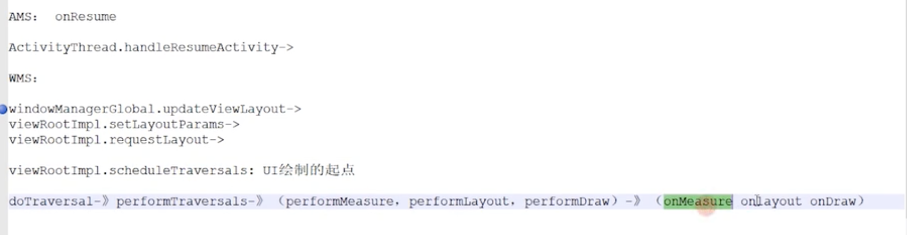
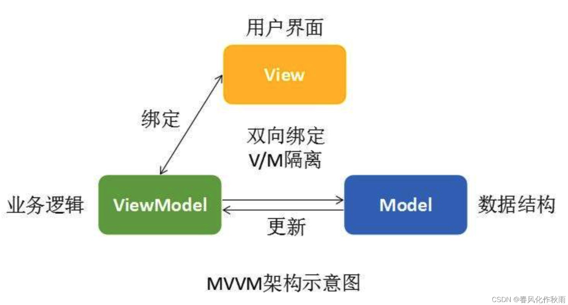

# Context

- Context 的使用上如何避免内存泄漏
- Android应用中哪些是 Context，一个应用有多少个 Context？
- 如何跨进程拿 Context？如 Activity 还没启动的时候如何拿 Context？
- Application中可以显示Dialog么？为什么？

**Context数量 = Activity数量 + Service数量 + 1 **

- 不要让生命周期长的对象引用Activity Context，即保证引用activity的对象要与activity本身生命周期是一样的

- 对于生命周期长的对象，可以使用Application Context

- 避免非静态的内部类，尽量使用静态类，避免生命周期问题，注意内部类对外部对象引用导致的生命周期变化

AMS 在启动 Activity 的时候，会构建表示 Activity 信息的 ActivityRecord 对象，其构造函数中会实例化 Token 对象

AMS 在接着上一步之后，会利用创建的 Token 构建 AppWindowContainerController 对象，最终将 Token 存储到 WMS 中的 mTokenMap 中

WMS 在 addWindow 时，会根据当前 Window 对象的 Token 进行校验

[Android Context 熟悉还是陌生](https://www.jianshu.com/p/cc0bb2a71ee8)

[为什么不能使用 Application Context 显示 Dialog？](https://juejin.cn/post/6867390363020361742)

# Activity Service 四大组件

- 对Activity的理解是什么
- 启动模式以及使用场景
- Service启动方式以及如何停止
- [startService 和 bingService区别](https://link.juejin.cn/?target=https%3A%2F%2Fwww.jianshu.com%2Fp%2Fd870f99b675c) 
- 广播的使用场景，原理
- Intent可以携带哪些数据？数组类型

**每个 Activity 包含了一个 Window 对象，这个对象是由 PhoneWindow 做的实现。而 PhoneWindow 将 DecorView 作为了一个应用窗口的根 View，这个 DecorView 又把屏幕划分为了两个区域：一个是 TitleView，一个是 ContentView，而我们平时在 Xml 文件中写的布局正好是展示在 ContentView 中的。**


由于Intent有大小限制（通常为1MB左右）

[Activity的四种启动模式应用场景](https://blog.csdn.net/black_bird_cn/article/details/79764794)

[Android中startService和bindService的区别](https://www.jianshu.com/p/d870f99b675c)

[23 个安卓重难点突破，带你吃透 Service 知识点](https://juejin.cn/post/6844903986131271688#heading-17)

# OOM和内存泄漏

- 为什么会出现OOM
- 哪些原因会导致OOM
- debug包有什么修改方式使不出现oom
- 有哪些原因会引起内存泄漏
- 内存泄漏有设么方式检测？用过哪些工具，其中的原理是什么

用ActivityLifecycleCallbacks接口来检测Activity生命周期 ，主要是在Activity的&**onDestroy**方法中，手动调用 GC，然后利用ReferenceQueue+WeakReference，来判断是否有释放不掉的引用，然后结合dump memory的hpof文件, 用[HaHa](https://link.juejin.cn/?target=https%3A%2F%2Fgithub.com%2Fsquare%2Fhaha)分析出泄漏地方


[Android性能优化：关于 内存泄露 的知识都在这里了！](https://www.jianshu.com/p/97fb764f2669)

[Java内存问题 及 LeakCanary 原理分析](https://juejin.cn/post/6844903583129796622)

[Android Handler：详解 Handler 内存泄露的原因](https://www.jianshu.com/p/ed9e15eff47a)

# ContentProvider

Android系统为什么会设计ContentProvider，进程共享和线程安全问题

1）提供一种跨进程数据共享的方式：

由系统来管理ContentProvider的创建、生命周期及访问的线程分配，简化我们在应用间共享数据（进程间通信）的方式。我们只管通过ContentResolver访问ContentProvider所提示的数据接口，而不需要担心它所在进程是启动还是未启动 。

（2）更好的数据访问权限管理：

ContentProvider可以对开发的数据进行权限设置，不同的URI可以对应不同的权限，只有符合权限要求的组件才能访问到ContentProvider的具体操作

# Handle机制

- Looper.loop()为什么不会阻塞主线程
- IdHandler(闲时机制）；postDelay()的具体实现
- post()与sendMessage()区别
- 用Handler需要注意什么问题，怎么解决的?

1. Looper 死循环为什么不会导致应用卡死，会消耗大量资源吗？
2. 主线程的消息循环机制是什么（死循环如何处理其它事务）？
3. ActivityThread 的动力是什么？（ActivityThread执行Looper的线程是什么）
4. Handler 是如何能够线程切换，发送Message的？（线程间通讯）
5. 子线程有哪些更新UI的方法。
6. 子线程中Toast，showDialog，的方法。（和子线程不能更新UI有关吗）
7. 如何处理Handler 使用不当导致的内存泄露？
7. Handle内存泄漏，最终谁持有了activity

[**Android消息机制**](https://github.com/interviewandroid/AndroidInterView/blob/master/study/framework/Android%E6%B6%88%E6%81%AF%E6%9C%BA%E5%88%B6.md)

一句话说清原理：

Handler通过sendMessage发送消息，将消息放入MessageQueue中，在MessageQueue中通过时间的维度来进行排序，Looper通过调用loop方法不断的从MessageQueue中获取消息，执行Handler的dispatchMessage，最后调用handleMessage方法。

首先在主线程里会有创建一个Looper对象保存在threadLocal中，这个Loop同时持有了一个MessageQueue对象。染回创建handle获取looper中的messageQueue对象，在不同线程调用sendMessage把消息放入到MessageQueue队列。有消息时会唤起Loop的loop方法循环查询，调用dispatvhMessage处理，最后调用了handleMessage

说到Handler，就不得不提与之密切相关的这几个类：Message、MessageQueue，Looper。

- **Message**。 Message中有两个成员变量值得关注：target和callback。target其实就是发送消息的Handler对象，callback是当调用handler.post(runnable)时传入的Runnable类型的任务。post事件的本质也是创建了一个Message，将我们传入的这个runnable赋值给创建的Message的callback这个成员变量。
- **MessageQueue**。消息队列很明显是存放消息的队列，值得关注的是MessageQueue中的next()方法，它会返回下一个待处理的消息。
- **Looper**。Looper消息轮询器其实是连接Handler和消息队列的核心。首先我们都知道，如果想要在一个线程中创建一个Handler，首先要通过Looper.prepare()创建Looper，之后还得调用Looper.loop()开启轮询。我们着重看一下这两个方法。

prepare()。这个方法做了两件事：首先通过ThreadLocal.get()获取当前线程中的Looper,如果不为空，则会抛出一个RunTimeException，意思是一个线程不能创建2个Looper。如果为null则执行下一步。第二步是创建了一个Looper，并通过ThreadLocal.set(looper)。将我们创建的Looper与当前线程绑定。这里需要提一下的是消息队列的创建其实就发生在Looper的构造方法中。

loop()。这个方法开启了整个事件机制的轮询。它的本质是开启了一个死循环，不断的通过MessageQueue的next()方法获取消息。拿到消息后会调用msg.target.dispatchMessage()来做处理。其实我们在说到Message的时候提到过，msg.target其实就是发送这个消息的handler。这句代码的本质就是调用handler的dispatchMessage()。Handler。上面做了这么多铺垫，终于到了最重要的部分。Handler的分析着重在两个部分：发送消息和处理消息

- Handler。上面做了这么多铺垫，终于到了最重要的部分。Handler的分析着重在两个部分：发送消息和处理消息

发送消息。其实发送消息除了sendMessage之外还有sendMessageDelayed和post以及postDelayed等等不同的方式。但它们的本质都是调用了sendMessageAtTime。在sendMessageAtTime这个方法中调用了enqueueMessage。在enqueueMessage这个方法中做了两件事：通过msg.target = this实现了消息与当前handler的绑定。然后通过queue.enqueueMessage实现了消息入队。

处理消息。消息处理的核心其实就是dispatchMessage()这个方法。这个方法里面的逻辑很简单，先判断msg.callback是否为null，如果不为空则执行这个runnable。如果为空则会执行我们的handleMessage方法。

**IdleHandler**

IdleHandler是主线程在开始加载页面完成后调用的方法，可以提高性能

IdleHandler是一个回调接口，可以通过MessageQueue的addIdleHandler添加实现类。当MessageQueue中的任务暂时处理完了（没有新任务或者下一个任务延时在之后），这个时候会回调这个接口，返回false，那么就会移除它，返回true就会在下次message处理完了的时候继续回调。

**同步屏障**

屏障消息就是为了确保异步消息的优先级，设置了屏障后，只能处理其后的异步消息，同步消息会被挡住，除非撤销屏障。

**为什么系统不建议在子线程访问UI**

在某些情况下，在子线程中是可以更新UI的。但是在ViewRootImpl中对UI操作进行了checkThread，但是我们在OnCreate和onResume中可以使用子线程更新UI，由于我们在ActivityThread中的performResumeActivity方法中通过addView创建了ViewRootImpl，这个行为是在onResume之后调用的，所以在OnCreate和onResume可以进行更新UI。

**Loop 死循环，为什么没有阻塞 主线程**

- 真正会卡死主线程的操作是在回调oncreat、onstart、onresume中，会导致卡帧，甚至ANR
- 涉及linux pipe机制,主线程中messaequeue没有消息，会阻塞loope 中queue.next，会释放CPU资源。直到下个消息往管道里写数据时会唤起主线程工作。
- epoll机制多路复用机制，监控多个描述符，某个描述符就位时，立刻通知读写

这里就涉及到Linux pipe/epoll机制，简单说就是在主线程的MessageQueue没有消息时，便阻塞在loop的queue.next()中的nativePollOnce()方法里，此时主线程会释放CPU资源进入休眠状态，直到下个消息到达或者有事务发生，通过往pipe管道写端写入数据来唤醒主线程工作。这里采用的epoll机制，是一种IO多路复用机制，可以同时监控多个描述符，当某个描述符就绪(读或写就绪)，则立刻通知相应程序进行读或写操作，本质同步I/O，即读写是阻塞的。 

**Handle内存泄漏，最终谁持有了activity**

activityThread  ->  looper ->messageQueue -> msg -> handler -> activity

HandlerThread 是一个具有消息循环的Thread，里面用到了Syncronized线程同步

**[Android 中 MessageQueue 的 nativePollOnce ](https://www.cnblogs.com/jiy-for-you/p/11707356.html)**

方法用于“等待”, 直到下一条消息可用为止.

[Handler 面试相关](https://blog.csdn.net/pengyu1801/article/details/104718819/)

# 性能优化

- UI方面的优化


**WebView启动优化**

1. 我们可以定义全局WebView对象并提前初始化，如果需要使用WebView加载页面直接使用初始化好的WebView对象就可以了。WebView第一次创建比较耗时，可以预先创建WebView，提前将其内核初始化。

2. 使用WebView缓存池，用到WebView的地方都从缓存池取，缓存池中没有缓存再创建，注意内存泄漏问题。

3. 本地预置html和css，WebView创建的时候先预加载本地html，之后通过js脚本填充内容部分。
4. webview 可以加载网络资源，那么也是可以加载本地的资源，在apk 启动的时候，我们可以把整个前端代码文件下载解压到本地的文件路径中，然后通过file：///...index.html 去打开本地的资源
5. 可以把前端的ajax请求提前到和页面加载同时进行，由客户端请求数据，等到H5加载完毕，直接向客户端索要即可
6. 图片资源的拉取是最为耗时的，一个比较好的解决方案就是先加载并展示非图片内容，延迟这些图片的加载，以提升用户体验。WebView有一个setBlockNetworkImage(boolean)方法，该方法的作用是是否屏蔽图片的加载

[Android WebView最佳优化（WebView池）](https://blog.csdn.net/u011082160/article/details/118245494)

[android性能优化(三)之Webview优化](https://zhuanlan.zhihu.com/p/79725603)

[android性能优化(二)之卡顿优化](https://blog.csdn.net/qingtiantianqing/article/details/100066873)

[面试官：今日头条启动很快，你觉得可能是做了哪些优化](https://juejin.cn/post/6844903958113157128#heading-17)

[今日头条App 页面秒开方案详解](https://mp.weixin.qq.com/s/KwvWURD5WKgLKCetwsH0EQ)

# Android多进程

[**Java 中的进程通信方式**](https://links.jianshu.com/go?to=https%3A%2F%2Fblog.csdn.net%2Fqq_38225558%2Farticle%2Fdetails%2F87118551)：管道(pipe)、有名管道(namedpipe)、信号量(semophore) 、套接字(socket)、消息队列(messagequeue) 、共享内存(shared memory) 、信号(sinal)

[**Android 中的进程通信方式**](https://links.jianshu.com/go?to=https%3A%2F%2Fblog.csdn.net%2Fu011240877%2Farticle%2Fdetails%2F72863432)：AIDL(基于 Binder)、Messenger (基于 Binder)、Socket、Binder (基于 mmp 共享内存)、文件

**文件共享：**

对同一个文件先后写读，从而实现传输，Linux机制下，可以对文件并发写，所以要注意同步。顺便一提，Windows下不支持并发读或写。

**Messenger：**

Messenger是基于AIDL实现的，服务端（被动方）提供一个Service来处理客户端（主动方）连接，维护一个Handler来创建Messenger，在onBind时返回Messenger的binder。

双方用Messenger来发送数据，用Handler来处理数据。Messenger处理数据依靠Handler，所以是串行的，也就是说，Handler接到多个message时，就要排队依次处理。

**AIDL：**

AIDL通过定义服务端暴露的接口，以提供给客户端来调用，AIDL使服务器可以并行处理，而Messenger封装了AIDL之后只能串行运行，所以Messenger一般用作消息传递。

通过编写aidl文件来设计想要暴露的接口，编译后会自动生成响应的java文件，服务器将接口的具体实现写在Stub中，用iBinder对象传递给客户端，客户端bindService的时候，用asInterface的形式将iBinder还原成接口，再调用其中的方法。

**ContentProvider：**

系统四大组件之一，底层也是Binder实现，主要用来为其他APP提供数据，可以说天生就是为进程通信而生的。自己实现一个ContentProvider需要实现6个方法，其中onCreate是主线程中回调的，其他方法是运行在Binder之中的。自定义的ContentProvider注册时要提供authorities属性，应用需要访问的时候将属性包装成Uri.parse("content://authorities")。还可以设置permission，readPermission，writePermission来设置权限。 ContentProvider有query，delete，insert等方法，看起来貌似是一个数据库管理类，但其实可以用文件，内存数据等等一切来充当数据源，query返回的是一个Cursor，可以自定义继承AbstractCursor的类来实现。

**Socket：**

学过计算机网络的对Socket不陌生，所以不需要详细讲述。只需要注意，Android不允许在主线程中请求网络，而且请求网络必须要注意声明相应的permission。然后，在服务器中定义ServerSocket来监听端口，客户端使用Socket来请求端口，连通后就可以进行通信。

[Android 多线程使用及原理（Handler、线程池）](https://blog.csdn.net/qq_51598534/article/details/142143630)

# 多线程开发


[面试官：说说多线程并发问题](https://juejin.cn/post/6844903941830869006)

[面试必备：Kotlin 线程同步的 N 种方法](https://juejin.cn/post/6981952428786597902)

# UI适配方案

- 对于 UI 稿的 px 是如何适配的

今日头条方案

动态改变 density 进行适配，适配后的 density = 设备真实宽度(单位 px) / 设计稿的宽度（单位 dp）

宽高限定方案

- 将屏幕宽度均分为 1080 份，每份 1 px，声明 1080 个 key 值，值从 1 px 开始递增，每次递增 1 px
- 将屏幕高度均分为 1920 份，每份 1 px，声明 1920 个 key 值，值从 1 px 开始递增，每次递增 1 px

smallWidth

即最小宽度，指的是最短的那一个边长，而不考虑屏幕的方向

[一文读懂 Android 主流屏幕适配方案](https://juejin.cn/post/6999445137491230728)

[今日头条屏幕适配方案终极版正式发布!](https://juejin.cn/post/6844903697000972295)

[一种极低成本的Android屏幕适配方式（今日头条）](https://mp.weixin.qq.com/s?__biz=MzI1MzYzMjE0MQ==&mid=2247484502&idx=2&sn=a60ea223de4171dd2022bc2c71e09351&scene=21#wechat_redirect)

# Bitmap

- 下载一张很大的图，如何保证不 oom？
- biamap复用
- Bitmap内存大小，注意事项，如何优化
- ##### Bitmap对象的理解
- ##### 对inBitmap的理解。

**内存大小 = （设备屏幕dpi / 资源所在目录dpi）^ 2 × 图片原始宽 × 图片原始高 × 像素大小**

图片内存大小以是Bitmap的实际尺寸大小为准，而不是图片显示大小

- 对图片质量进行压缩
- 对图片尺寸进行压缩

ALPHA_8：表示8位Alpha位图，每像素占1byte内存；

RGB_565：表示R为5位，G为6位，B为5位，一共16位，每像素占2byte内存；

ARGB_4444：表示16位位图，每像素占2byte内存（poor quality - Android Deprecated）；

ARGB_8888：表示32位ARGB位图，每像素占4byte内存（Recommended）

利用的就是inBitmap指定将要重复利用的Bitmap对象的内存。同时需要指定inMutable=true表示对象是可变的。如果inPreferredConfig = android.graphics.Bitmap.Config.HARDWARE，inMutable属性永远为false。

**下载一张很大的图，如何保证不 oom**

通过二次采样，对inSampleSize重新设置

如果不允许压缩 则用**BitmapRegionDecoder**


 **图片储存优化**

1.尺寸优化：通过减小宽高来实现
2.质量压缩：改变一个像素占用的内存（优化解码率）
3.内存重用：需要用到inBitmap属性

**图片加载优化**

1.异步优化：图片放在后台请求（不占用主UI的资源）
2.图片缓存：对于列表中的图片进行缓存（本地文件中的缓存）
3.网络请求：使用OkHttp进行图片请求（优点很多）
4.懒加载：当图片呈现到可视区域再进行加载**

**Android图片压缩**

 1. 质量压缩

 2. 尺寸压缩

 3. 采样率压缩

 4. 通过JIN调用libjpeg库压缩

 5. 图片格式

```java
 public static Bitmap compressInSampleSize(Resources resources, int resId, int >reqWidth, int reqHeight) {
       BitmapFactory.Options options = new BitmapFactory.Options();
       options.inJustDecodeBounds = true;
       Bitmap bitmap = BitmapFactory.decodeResource(resources, resId, options);
       options.inSampleSize = getInSampleSize(bitmap, reqWidth, reqHeight);
       options.inJustDecodeBounds = false;
       bitmap.recycle();
       Bitmap resultBitmap = BitmapFactory.decodeResource(resources, resId, options);
       return resultBitmap;
   }

```

Android 8.0 之后Bitmap像素内存放在native堆，到了Android3.0之后，Bitmap的内存则已经全部分配在VM堆上，这两种分配方式的区别在于，Native堆的内存不受Dalvik虚拟机的管理，我们想要释放Bitmap的内存，必须手动调用Recycle方法。

[android bitmap的内存分配和优化](https://cloud.tencent.com/developer/article/1034445)

[Android 图片压缩最常用的几种方法!](https://www.jianshu.com/p/1f69238b8874)

[Android性能优化系列之Bitmap图片优化](https://blog.csdn.net/u012124438/article/details/66087785)

[Bitmap的inBitmap使用](https://my.oschina.net/u/3863980/blog/3019921)

[Bitmap优化](https://blog.csdn.net/anhenzhufeng/article/details/106838441)

# WebView 与 JS 交互方式

- shouldOverrideUrlLoading、onJsPrompt使用有啥区别 

NA端截图如何传递给h5？

- 直接返回Base64数据
- **临时路径+拦截请求**
  - 生成临时路径并返回
    将图片存储到缓存目录，生成一个临时路径（如`customScheme://cache/snapshot.png`），并通过桥接回调将路径传给H5。H5需通过特定请求（如``）加载图片。
  - **NA拦截H5的图片请求**
    对于第二种方式，NA需通过`WKWebViewConfiguration.setURLSchemeHandler`拦截自定义协议（如`customScheme`）的请求，从缓存目录读取图片数据并返回给H5

**Js代用native方法，它底层的原理？**

JS通过注入的全局对象或协议拦截调用Native，WebKit通过桥接机制实现跨语言通信

**桥接机制**：通过`addJavascriptInterface`将Java对象注入到WebView的JS上下文中。JS可直接调用该对象的方法。

**WebKit/Chromium的实现**

- **进程模型**：
  - JS运行在**渲染进程**，Java代码运行在**浏览器进程**（主进程）。
  - IPC通信（如Chromium的Mojo框架）负责跨进程调用。
- **桥接生成**：
  - 通过代码绑定（如JNI或自动生成的胶水代码），将Java方法映射为JS可调用的接口。

[最全面总结 Android WebView与 JS 的交互方式](https://www.jianshu.com/p/345f4d8a5cfa)

# APP打包流程

- aapt 工具打包资源文件，生成 R.java 文件
- aidl 工具处理 AIDL 文件，生成对应的 .java 文件
- javac 工具编译 Java 文件，生成对应的 .class 文件
- 把 .class 文件转化成 Davik VM 支持的 .dex 文件
- apkbuilder 工具打包生成未签名的 .apk 文件
- jarsigner 对未签名 .apk 文件进行签名
- zipalign 工具对签名后的 .apk 文件进行对齐处理

AAPT 和 AAPT2 的区别

使用AAPT2替代了 AAPT 来编译 Android 资源。AAPT2 实现了资源的增量编译，它将资源的编译拆分成 Compile 和 Link 两个步骤。前者资源文件以二进制形式编译 Flat 格式，后者合并所有的文件再打包

## Apk签名

- APK 为什么要签名
- 是否了解过具体的签名机制

Android 为了确认 apk 开发者身份和防止内容的篡改，设计了一套 apk 签名的方案保证 apk 的安全性，即在打包时由开发者进行 apk 的签名，在安装 apk 时Android 系统会有相应的开发者身份和内容正确性的验证，只有验证通过才可以安装 apk，签名过程和验证的设计就是基于非对称加密的思想。
 Android 在 7.0 以前使用的一套签名方案：在 apk 根目录下的 META-INF/ 文件夹下生成签名文件，然后在安装时在系统的 PackageManagerService 里进行签名文件的验证。
 从 7.0 开始，Android 提供了新的 V2 签名方案：利用 apk(zip) 压缩文件的格式，在几个原始内容区之外增加了一块用于存放签名信息的数据区，然后同样在安装时在系统的 PackageManagerService 里进行 V2 版本的签名验证，V2 方案会更安全、使校验更快安装更快。
 当然 V2 签名方案会向后兼容，如果没有使用 V2 签名就会默认走 V1 签名方案的验证过程。

V1是签名以文件的形式存在于这个版本的apk包就是一个标准的zip包

V2是对整个zip包进行签名，而且在zip包中增加了 一个apk signatureblock，里面保存签名信息

# Binder机制

- 介绍下 Binder 机制，与内存共享机制有什么区别
- Binder机制如何跨进程
- Binder是如何做到一次性拷贝的
- MMAP的原理
- 为什么Intent不能传递大数据
- 四大组件底层通信如何实现
- 为什么Android选择Binder作为应用程序中主要的IPC机制

Binder是基于C/S架构的，简单解释下C/S架构，是指客户端(Client)和服务端(Server)组成的架构，Client端有什么需求，直接发送给Server端去完成，架构清晰明朗，Server端与Client端相对独立，稳定性较好；而共享内存实现方式复杂，没有客户与服务端之别， 需要充分考虑到访问临界资源的并发同步问题，否则可能会出现死锁等问题；从这稳定性角度看，Binder架构优越于共享内存。

1. 数据先从发送方的缓存区拷贝到内核开辟的缓存区中，再 从内核缓存区拷贝到接收方的缓存区，一共一次拷贝

2. Binder 基于 C/S 架构 ，Server 端与 Client 端相对独立，稳定性较好

3. Binder 机制为 每个进程分配了 UID/PID 且在 Binder 通信时会根据 UID/PID 进行有效性检测

**Binder机制主要的流程是这样的**

服务端通过Binder驱动在ServiceManager中注册我们的服务。

客户端通过Binder驱动查询在ServiceManager中注册的服务。

ServiceManager通过Binder驱动返回服务端的代理对象。

客户端拿到服务端的代理对象后即可进行进程间通信。

跨进程是内核空间和物理内存有映射关系，另一进程也一样，所以共享了

MMAP:Linux通过将一个虚拟内存区域与一个磁盘上对象关联起来，以初始化这个虚拟内存区域的内容，这个过程称为内存映射（mmap）

MMAP作用让一块虚拟内存指向已知的一块物理内存，（物理内存是binder提供的）

这样在Binder通信机制中，binder_mmap()会将Server进程的虚拟地址和内核虚拟地址映射到同一个物理页面。那么当Client进程向Server进程发送请求时，只需要将Client的数据拷贝到内核空间即可！由于Server进程的地址和内核空间映射到同一个物理页面，因此，Client中的数据拷贝到内核空间时，也就相当于拷贝到了Server进程中。因此，Binder通信机制中，数据传输时，只需要1次内存拷贝！这就是Binder通信原理的精髓所在！


**四大组件底层通信如何实现**

都是Binder通信

bindService: 

1. 客户端进程与ServiceManager通信获得AMS的iBinder
2. 客户端通过AMS的Binder与AMS通信，请求bindService
3. AMS与服务端进程通信执行Service的onBind
4. 服务端进程与ServiceManager通信获得AMS的IBinder
5. 服务端进程通过AMS的IBinder与AMS通信，发布自己的Binder给AMS
6. AMS与客户端通信，转发服务端的IBinder(代理BinderProxy)

**intent不能传递大数据**

底层是binder通信，大小受共享内存限制，同步传递为(1M-8k)。异步传递大小为1/2大小。

[为什么 Android 要采用 Binder 作为 IPC 机制](https://www.zhihu.com/question/39440766/answer/89210950)

[Carson带你学Android：图文详解Binder跨进程通信原理](https://www.jianshu.com/p/4ee3fd07da14)

[Android Binder通信一次拷贝你真的理解了吗？](https://code84.com/157851.html)

# 事件分发

- View、ViewGroup的事件传递机制，如何解决滑动冲突？ 回答如何滑动-冲突最好是举出实际的场景和怎么解决的
- 触摸事件的传递，View如何消费

1个点击事件发生后，事件先传到`Activity`、再传到`ViewGroup`、最终再传到 `View`

(1) 事件从Activity.dispatchTouchEvent()开始传递，只要没有被停止或拦截，从最上层的View(ViewGroup)开始一直往下(子View)传递。子View可以通过onTouchEvent()对事件进行处理。

(2) 事件由父View(ViewGroup)传递给子View，ViewGroup可以通过onInterceptTouchEvent()对事件做拦截，停止其往下传递。

(3) 如果事件从上往下传递过程中一直没有被停止，且最底层子View没有消费事件，事件会反向往上传递，这时父View(ViewGroup)可以进行消费，如果还是没有被消费的话，最后会到Activity的onTouchEvent()函数。

(4) 如果View没有对ACTION_DOWN进行消费，之后的其他事件不会传递过来。

(5) OnTouchListener优先于onTouchEvent()对事件进行消费。 上面的消费即表示相应函数返回值为true。

整个View的事件转发流程是：

View.dispatchEvent->View.setOnTouchListener->View.onTouchEvent

在dispatchTouchEvent中会进行OnTouchListener的判断，如果OnTouchListener不为null且返回true，则表示事件被消费，onTouchEvent不会被执行；否则执行onTouchEvent。

```java
  public boolean dispatchTouchEvent(MotionEvent event) {
        if (!onFilterTouchEventForSecurity(event)) {
            return false;
        }
 
        if (mOnTouchListener != null && (mViewFlags & ENABLED_MASK) == ENABLED &&
                mOnTouchListener.onTouch(this, event)) {
            return true;
        }
        return onTouchEvent(event);
```

> setOnLongClickListener和setOnClickListener不是只能执行一个

**ViewGroup事件传递**

Android事件分发是先传递到ViewGroup，再由ViewGroup传递到View的。

2. 在ViewGroup中可以通过onInterceptTouchEvent方法对事件传递进行拦截，onInterceptTouchEvent方法返回true代表不允许事件继续向子View传递，返回false代表不对事件进行拦截，默认返回false。

3. 子View中如果将传递的事件消费掉，ViewGroup中将无法接收到任何事件

**解决滑动冲突**

1、如果ViewGroup找到了能够处理该事件的View，则直接交给子View处理，自己的onTouchEvent不会被触发；

2、可以通过复写onInterceptTouchEvent(ev)方法，拦截子View的事件（即return true），把事件交给自己处理，则会执行自己对应的onTouchEvent方法

3、子View可以通过调用getParent().requestDisallowInterceptTouchEvent(true);  阻止ViewGroup对其MOVE或者UP事件进行拦截；


 dispatchTouchEvent()返回true，后续事件（ACTION_MOVE、ACTION_UP）会再传递，如果返回false，dispatchTouchEvent()就接收不到ACTION_UP、ACTION_MOVE

[Android事件分发机制详解：史上最全面、最易懂](https://www.jianshu.com/p/38015afcdb58)

[Android中的dispatchTouchEvent()、onInterceptTouchEvent()和onTouchEvent()](https://blog.csdn.net/xyz_lmn/article/details/12517911)

# Window

- Activity、View、Window 之间的关系

- View.post 为什么可以获取到 View 的宽高

- Activity中的Window的初始化和显示过程

- Activity如何与wiindow与view进行分工合作

  

Activity 是四大组件之一，也是我们的界面载体，可以展示页面；而 View 实际上就是一个一个的视图，这些视图可以搭载在一个 Layout 文件上，通过 Activity 的 `setContentView()` 方法传递给 Activity；Window 是一个窗体，每个 Activity 对应一个 Window，通常我们在代码中用 getWindow() 来获取它。

**Activity中的Window的初始化和显示过程**

1 Activity在其attach方法中创建了Window，实际上创建的是PhoneWindow，并通过各种回调等建立起与Activity的联系，我们在Activity中使用getWindow（）所得到的即是这个创建的Window。
2 在PhoneWindow中装载了一个顶级的View，即DecorView，它实际是一个FrameLayout，并通过各种主题样式选择加载不同的视图来填充DecorView，这部分被称作mContentRoot。
3 setContentView设置我们自己需要展示的视图，这部分视图被填充到了DecorView的一块子ViewGroup中，这块子ViewGroup被称作contentParent。
4 DecorView最终是通过WindowManager的addView方法添加到Window的，并且最终在Activity的onResume方法执行后显示出来。
5 在使用requestWindowFeature来设置样式时，实际上是调用了PhoneWindow的requestFeature方法，会将样式存储在Window的mLocalFeatures变量中，当installDecor时，会应用这些样式。也就是说，当需要通过requestWindowFeature来请求样式时，应该在setContentView方法之前调用，因为setContentView方法的调用会导致DecorView的创建并应用样式，如果在之后调用则会导致不会生效，因为此时DecorView已经创建完成了。

将我们调用 View.post 方法传入的 Runnable 发送到主线程的消息队列，消息是同步类型，也就是放在HandleActionQueue中。Handler 的消息队列循环过程中，在一个消息执行完之后才会取下一个消息。因为这一特性，所以在异步消息没执行完之前，消息队列中的消息是不会执行的。所以调用了 HandlerActionQueue 的 executeActions 方法，发送到主线程消息队列的消息们不会被立即执行，等 performTraversals 方法执行完，也就是异步消息结束之后， HandlerActionQueue 的 executeActions 方法，发送到主线程消息队列的消息们才会被执行。ViewRoomImpl 的 performTraversals 方法注释 1 处，开始了 View 绘制流程，依次是测量 performMeasure、布局 performLayout 和绘制 performDraw，这三个方法走完，标志着我们的 UI 已经完成显示了。

**window是何时创建的**

1. **Activity启动与Window创建**
   当通过`ActivityThread`启动Activity时，首先会调用`performLaunchActivity()`方法创建Activity实例，随后执行其`attach()`方法。在此方法中，通过`new PhoneWindow(this, ...)`显式创建了Window对象。这一步建立了Activity与Window的关联，并为其配置了WindowManager。
2. **PhoneWindow的初始化**
   `PhoneWindow`是Window类的唯一实现，负责管理Activity的视图层级。在`attach()`方法中，除了创建PhoneWindow，还会设置WindowManager，通过`setWindowManager()`将Window与系统服务（如WMS）关联。
3. **DecorView的创建时机**
   Window的视图根节点`DecorView`并非在创建Window时立即生成，而是在调用`setContentView()`时创建。此方法会触发`installDecor()`，初始化包含标题栏和内容区域的DecorView。这一步骤通常发生在Activity的`onCreate()`阶段。
4. **ViewRootImpl的绑定**
   `ViewRootImpl`作为连接Window与View系统的核心，其创建和绑定发生在Activity的`onResume()`阶段。此时，通过`WindowManagerGlobal.addView()`将DecorView添加到Window，并创建对应的ViewRootImpl，从而启动视图的绘制流程。

[简析Window、Activity、DecorView以及ViewRoot之间的错综关系](https://www.jianshu.com/p/8766babc40e0)

[View.post 为什么可以获取到 View 的宽高](https://juejin.cn/post/6994044328918122510#heading-3)
[震惊！Android子线程也能修改UI？](https://www.jianshu.com/p/1b2ccd3e1f1f)

[Android Activity之Window的创建过程](https://blog.csdn.net/qq_28261343/article/details/78817184)


# UI渲染

**Android屏幕刷新机制。**

1， 界面上任何一个 View 的刷新请求最终都会走到 ViewRootImpl 中的 scheduleTraversals() 里来安排一次遍历绘制 View 树的任务；

2， scheduleTraversals() 会先过滤掉同一帧内的重复调用，在同一帧内只需要安排一次遍历绘制 View 树的任务即可，这个任务会在下一个屏幕刷新信号到来时调用 performTraversals() 遍历View 树，遍历过程中会将所有需要刷新的 View 进行重绘；

3接着 scheduleTraversals() 会往主线程的消息队列中发送一个同步屏障，拦截这个时刻之后所有的同步消息的执行，但不会拦截异步消息，以此来尽可能的保证当接收到屏幕刷新信号时可以尽可能第一时间处理遍历绘制 View 树的工作；

4 发完同步屏障后 scheduleTraversals() 才会开始安排一个遍历绘制 View 树的操作，作法是把 performTraversals() 封装到 Runnable 里面，然后调用 Choreographer 的 postCallback() 方法；

5，postCallback() 方法会先将这个 Runnable 任务以当前时间戳放进一个待执行的队列里，然后如果当前是在主线程就会直接调用一个native 层方法，如果不是在主线程，会发一个最高优先级的 message 到主线程，让主线程第一时间调用这个 native 层的方法；

6， native 层的这个方法是用来向底层注册监听下一个屏幕刷新信号，当下一个屏幕刷新信号发出时，底层就会回调 Choreographer 的onVsync() 方法来通知上层 app；

7，onVsync() 方法被回调时，会往主线程的消息队列中发送一个执行 doFrame() 方法的消息，这个消息是异步消息，所以不会被同步屏障拦截住；

8，doFrame() 方法会去取出之前放进待执行队列里的任务来执行，取出来的这个任务实际上是 ViewRootImpl 的 doTraversal() 操作；

9，上述第4步到第8步涉及到的消息都手动设置成了异步消息，所以不会受到同步屏障的拦截；

10，doTraversal() 方法会先移除主线程的同步屏障，然后调用 performTraversals() 开始根据当前状态判断是否需要执行performMeasure() 测量、perfromLayout() 布局、performDraw() 绘制流程，在这几个流程中都会去遍历 View 树来刷新需要更新的View；

# View绘制

- View、ViewGroup的绘制流程
- Android子线程也能修改UI
- requestLayout，invalidate 的区别
- onResume函数中度量宽高有效吗
- 线程中view.setText一定报错吗，为什么
- view的创建过程

绘制原理：View 的 requestLayout 和 ViewRootImpl##setView 最终都会调用 ViewRootImpl 的 requestLayout 方法。然后通过 scheduleTraversals 方法提交绘制任务，然后再通过DisplayEventReceiver向底层请求vsync垂直同步信号，当vsync信号来的时候，通过JNI回调回来，再通过Handler往消息队列post一个异步任务，最终是ViewRootImpl去执行绘制任务，最后调用performTraversals方法，完成绘制。

Choreographer：

从ActivityThread.handleResumeActivity开始，`ActivityThread.handleResumeActivity()->WindowManagerImpl.addView()->WindowManagerGlobal.addView()->初始化ViewRootImpl->初始化Choreographer->ViewRootImpl.setView()`

在ViewRootImpl的setView中会调用`requestLayout()->scheduleTraversals()`,然后是建立同步屏障

通过Choreographer线程单例的postCallback()提交一个任务mTraversalRunnable，这个任务是用来做View的三大流程的（measure、layout、draw）

Choreographer.postCallback()内部通过DisplayEventReceiver.nativeScheduleVsync()向系统底层注册VSYNC信号监听，当VSYNC信号来临时，会回调DisplayEventReceiver的dispatchVsync()，最终会通知FrameDisplayEventReceiver.onVsync()方法。

在onVsync()中取出之前传入的任务mTraversalRunnable，执行run方法，开始绘制流程。

绘制流程：



onCreate和onResume 子线程都可以刷新UI， （ 添加decoView关联wm操作，是在执行完onResume方法后才执行，）

**onMeasure职责**

进行测量


**requestLayout，invalidate 的区别**

1. requeLayout() : 控件会重新执行 onMesure() onLayout() ,比如 ScrollView中有LinearLaout ，LinearLayout里面有纵向排列的ImageView和TextView,那么假如ImageView的长宽发生了变化，而要立即在手机上显示这个变化的话，就可调用 imageView.requestLayout();这样的话ScrollView 会重新执行onMesure()这个方法会确定控件的大小然后在确定出自己的宽高，最后在执行onLayout()，这个方法是对所有的子控件进行定位的。他只调用measure()和layout()过程，不会调用draw()。
2. invalidate() :是自定义View 的时候，重新执行onDraw()方法，当view只在内容和可见度方面发生变化时调用。
3. layout()：对控件进行重新定位执行onLayout()这个方法，比如要做一个可回弹的ScrollView，思路就是随着手势的滑动子控件滑动，那么我们可以将ScrollView的子控件调用layout（l,t,r,b）这个方法就行了。

#### MeasureSpec

- EXACTLY: （match_parent或者 精确数据值）精确模式，对应的数值就是MeasureSpec当中的size。
- AT_MOST:(wrap_content)最大值模式，View的尺寸有一个最大值，View不超过MeasureSpec当中的Size值。
- UNSPECIFIED：（一般系统使用）无限制模式，View设置多大就给他多大。

**绘制流程**

measure() 

测量宽高 MeasureSpec，ViewGroup中并没有measure()也没有onMeasure()

layout()

根据测量完的数据进行定位  View.java的onLayout方法是空实现:因为子View的位置，是由其父控件的onLayout方法来确定的

draw()

可以看到一般情况下View的draw流程分为四步：

1. 绘制背景
2. 绘制自身内容（onDraw）
3. 遍历子View，调用其draw方法把绘制过程分发下去（dispatchDraw）
4. 绘制装饰（onDrawForeground）

**自定义View注意事项**

1. 让View支持wrap_conent
2. 让View支持padding
3. 尽量避免使用Handler，一般都可以用View自带的post方法代替
4. 在onDeatchFromWindow时，停止View的动画或线程（如果有的话）
5. 如果存在嵌套滑动，处理好滑动冲突

**UI原理**

1. Activity的attach 方法里创建PhoneWindow。
2. onCreate方法里的 setContentView 会调用PhoneWindow的setContentView方法，创建DecorView并且把xml布局解析然后添加到DecorView中。
3. 在onResume方法执行后，会创建ViewRootImpl，它是最顶级的View，是DecorView的parent，创建之后会调用setView方法。
4. ViewRootImpl 的 setView方法，会将PhoneWindow添加到WMS中，通过 Session作为媒介。  setView方法里面会调用requestLayout，发起绘制请求。
5. requestLayout 一旦发起，最终会调用 performTraversals 方法，里面将会调用View的三个measure、layout、draw方法，其中View的draw 方法需要一个传一个Canvas参数。
6. 最后分析了软件绘制的原理，通过relayoutWindow 方法将Surface跟当前Window绑定，通过Surface的lockCanvas方法获取Surface的的Canvas，然后View的绘制就通过这个Canvas，最后通过Surface的unlockCanvasAndPost 方法提交绘制的数据，最终将绘制的数据交给SurfaceFlinger去提交给屏幕显示。

**View的一次绘制原理**

ViewRootImpl 的 performTraversal() 方法会依次调用 `performMeasure()`、`performLayout()` 和 `performDraw()` 三个方法，这三个方法分别完成 DecorView 的测量、放置和绘制三大流程。

performMeasure() 方法会调用 DecorView 的 measure() 方法，在 measure() 方法中又会调用自己的 onMeasure() 方法。

DecorView 的 onMeasure() 方法会调用父类 FrameLayout 的 onMeasure() 方法，在 FrameLayout 的 onMeasure() 方法中，会调用子元素的 onMeasure() 方法测量子元素的宽高，接着子元素会重复父容器的 measure 过程，如此反复完成整个 View 树的遍历。

而 performLayout() 和 performDraw() 的执行流程与 performMeasure() 是类似的。

measure 过程决定了 View 的宽高，layout 过程决定了 View 的四个顶点的坐标和实际的 View 宽高，draw 过程则决定了 View 的具体绘制操作，只有 draw() 方法完成后 View 的内容才会在屏幕上展示。

[Android View绘制13问13答](https://www.cnblogs.com/punkisnotdead/p/5181821.html)

[面试官问你：自定义View跟绘制流程懂吗？帮你搞定面试官](https://juejin.cn/post/6844904005945016328)

[Android图形系统（四）应用篇：自定义View/ViewGroup详解](https://juejin.cn/post/7140332948485570596)

[Android高频面试专题 - 提升篇（二）View绘制流程](https://cloud.tencent.com/developer/article/1601353)

# Recyleview

- 按下列表item的button 同时上下滑动RecyclerView 事件是怎么处理的
- RecyclerView加载多图速度优化方案
- RecyclerView的缓存，局部刷新用过么
- RecyclerView缓存原理，局部刷新原理 

**RecycleView四级缓存**

- **Scrap**:屏幕内部的 ItemView,通过数据集的 Position 找到的，**可以直接复用不需要绑定**
- **Cache**:移出屏幕的 ItemView 放入一个CacheView（默认个数为2），就是比屏幕多两个 ItemView， 方便来回翻少量的View，**可以直接复用不需要绑定**
- **ViewCacheExtension**:用户自定义的缓存机制 

> **ViewCacheExtension Example **
>
> 
>
> 广告夹杂在 RecycleView 内，并且不会发生变化，广告和内容分开请求
>
> - 广告卡片
> - - 每页一共有四个广告
>   - 短期内不会发生变化
> - Cache 只关心 position，不关心 view type
> - RecycleViewPool 只关心 view type，每次都要重新绑定
> - 解决方法：在 ViewCacheExtension 保存四个广告的 Card

- **RecycleViewPool**:被废弃的 ItemView ，内部的 data 都是 dirty 的。通过ViewType来重新Bind数据的，RecycledViewPool默认的缓存数量是5个


`notifyItemRangeChanged`如果传入null表示更新全部，这时就要重写`onBindViewHolder`

```java
//在第一个OnBindViewHolder里面我们需要判断下payloads是否为空，如果为空的话执行默认的OnBindViewHolder方法，
//如果不为空的话，执行我们自己的局部刷新方法

@Override
    public void onBindViewHolder(TestDownLoadHolder holder, int position, List<Object> payloads) {
        XLog.e("--------------------------has  payloads");
        if (payloads.isEmpty()) {
            XLog.e("--------------------------no  payloads");
            onBindViewHolder(holder, position);
        } else {
            XLog.e("--------------------------false  payloads");
            final AppInfoBean appInfoBean = data.get(position);
            if (appInfoBean != null) {
                holder.mPbDownProgress.setProgress(appInfoBean.getProgress());
                holder.mBtDownLoad.setText(appInfoBean.getDownloadPerSize());
            }
        }
    }


//考虑要不要用
RecyclerView.ViewHolder viewHolder = mRecyclerView.findViewHolderForAdapterPosition(i);
            if (viewHolder != null && viewHolder instanceof ItemHolder) {
                ItemHolder itemHolder = (ItemHolder) itemHolder 
                    itemHolder.mButton.togglestate();
                }
            }
```

**RecyclerView加载多图速度优化方案**

1、控制线程数量 + 数据分页加载

我们在使用滑动控件呈现图片数据时，显然都会在getView方法里创建新的线程去异步加载图片，不可能有一百条或上千条数据一口气全部塞过来吧（当然你要这么干也是可以的），那么根据项目需求必然会进行分页加载，咱一页显示的item条数也别太夸张就好。而且，当我们点击屏幕快速向下滑动时，每个Item都会调用getView一次，必然会创建出很多线程去加载图片的URL资源，控制好线程的数量，加个线程池就非常有必要了。为了避免OOM导致FC，注意图片需要缓存，因为从内存中读取图片资源是非常快的。

2、重写onScrollStateChanged方法

这种方案用的也很普遍，相信只要细心观察，就会发现类似微博、Facebook、或者一些图片壁纸类的APP，在滑动时未加载的图片是不会立刻加载呈现的，只有当滑动停止后才会加载，这里需要注意一点的是，只加载当前屏幕内的图片。这么一说可能有童鞋就明白了。我们可以通过继承RecyclerView去自定义一个滑动控件，通过继承OnScrollListener后重写其 onScrolled方法 和 onScrollStateChanged 等方法来做相应处理。

**RecycleView优化**

- 布局优化

  - 减少布局嵌套
  - 使用merge
  - 如果所有 Item 的高度是固定的，设置 `setHasFixedSize(true)` 可以告诉 RecyclerView 不需要重新计算布局大小，从而提升性能

- 绘制优化

  - **使用 DiffUtil 进行数据更新****使用 DiffUtil 进行数据更新**

- 滑动优化

  - **预加载即将显示的视图**：

- 内存优化

  - **合理的缓存机制**：合理设置 RecyclerViewPool 的大小，控**合理的缓存机制**：合理设置 RecyclerViewPool 的大小，控
  - **用图片加载库**

  另外：少使用异步任务，局部刷新

[让你彻底长我RecyclerView的缓存机制](https://www.jianshu.com/p/3e9aa4bdaefd)

[阿里3轮面试都问了RecyclerView](https://www.zhihu.com/tardis/zm/art/457038322?source_id=1003)

[再也不用担心面试问RecyclerView了](https://www.jianshu.com/p/443d741c7e3e)

# Gradle

- Gradle 的工作原理

- Gradle的实现，gradle中task的生命周期。

- gradle生命周期，task，插件

- gradle熟悉么，自动打包知道么？

- 如何加快 Gradle 的编译速度？

- Gradle的Flavor能否配置sourceset？

  

  #### Gradle生命周期

[看完这一系列，彻底搞懂 Gradle](https://juejin.cn/post/6844903870091493384)

[Android 修炼手册】Gradle 篇 -- Gradle 的基本使用](https://blog.csdn.net/weixin_42118423/article/details/112138400)

初始化阶段，Gradle为项目创建了一个Project实例。给定的构建脚本只定义了一个项目，在多项目构建中，这个构建阶段变得更加重要。根据正在执行的项目，Gradle找出哪些项目依赖需要参与到构建中。

> 注意：在这个构建阶段当前已有的构建脚本代码都不会被执行。

配置阶段，Gradle构造了一个模型来表示任务，并参与到构建中来。增量式构建特性决定了模型中的task是否需要被运行。这个阶段非常适合与为项目或执行task设置所需的配置。

> 注意：项目每一次构建的任何配置代码都可以被执行——即使你只执行gradle tasks

执行阶段，所有的task都应该以正确的顺序被执行。执行顺序是由它们的依赖决定的。如果任务被认为没有修改过，将被跳过，这个牵涉到增量式构建，

gradle 构建分为三个阶段初始化阶段
初始化阶段主要做的事情是有哪些项目需要被构建，然后为对应的项目创建 Project 对象

配置阶段
配置阶段主要做的事情是对上一步创建的项目进行配置，这时候会执行 build.gradle 脚本，并且会生成要执行的 task

执行阶段
执行阶段主要做的事情就是执行 task，进行主要的构建工作

构建优化


# 动画

- 属性动画原理

Animation 通过PropertyValuesHolder 来更新对象的目标属性，如果用户没有设定目标属性的Property对象，那么会通过反射的形式调用目标属性的setter方法来更新属性值；否则，通过Property的set方法来设置属性值，这个属性值则通过KeyFrameSet的计算得到，而KeyFrameSet又是通过时间插值器和类型估值器来计算的，在动画执行的过程中不断计算当前时刻目标属性的值，然后 更新属性值来达到动画效果。

1. 视图动画：通过 XML 或代码定义平移（Translate）、旋转（Rotate）、缩放（Scale）、透明度（Alpha）四种变换。
2. 属性动画：通过反射或 `PropertyValuesHolder` 动态更新对象属性
3. 帧动画：逐帧播放图片序列。

直播间礼物动画需要兼顾动态化和高性能。例如，我们通过远程配置Lottie JSON文件实现礼物动态更新，结合对象池和异步加载保证流畅性。针对连击场景，优化了动画合并逻辑和渲染性能，使100连击的FPS从20提升至55+。

# AOP

- ASM能hook第三方sdk里面的类么？第三方的jar包呢？
- Transform原理，Transform中是否能修改sdk中的class文件。

- ASM
- AspectJ

Android AOP就是通过预编译方式和运行期动态代理实现程序功能的统一维护的一种技术。利用AOP可以对业务逻辑的各个部分进行隔离，从而使得业务逻辑各部分之间的耦合度降低，提高程序的可重用性，提高开发效率。

- ASM是一个框架/库，它为您提供了一个API来操纵现有的字节码和/或轻松生成新的字节码
- AspectJ是Java语言之上的一种语言扩展，具有它自己的语法，专门用于扩展具有面向方面编程概念的Java运行时的功能。它包含一个编译器/编织器，它可以在编译时或运行时运行

Transform API拦截到所有输入的class文件和jar包

Transform API 允许开发者创建自定义的 Transform 类，并将其注册到 Android Gradle Plugin 中。每个 Transform 都是一个 Gradle Task，这些 Task 通过 TaskManager 按顺序链接起来形成一个链式结构。第一个 Transform 接收来自 javac 编译的结果，以及已经拉取到的所有依赖库中的类文件。随后，每一个 Transform 可以选择修改这些输入，并将结果传递给下一个 Transform 直至最后一个 Transform 完成处理

# ART

- jvm、dalvik、art介绍下，解决了什么问题？

- **AOT预编译**：安装时将Dex字节码完全编译为本地机器码，消除运行时编译开销，显著提升启动速度和执行效率 。

- **混合编译策略**：Android 7.0引入JIT作为补充，结合AOT与运行时热点代码编译，平衡安装时间和性能 。

- 垃圾回收优化

  ：

  - **并发标记清除（CMS）** ：标记阶段与应用线程并发执行，将GC暂停时间从Dalvik的50ms缩短至3ms 。
  - **分代回收**：针对不同对象生命周期采用差异策略，减少全堆扫描频率 。

解决的问题

- **性能瓶颈**：彻底解决Dalvik因JIT导致的卡顿问题，使动画、触控响应更流畅 。
- **存储空间权衡**：AOT编译增加应用安装体积（约10%-20%），但通过压缩和ODEX优化缓解

JVM基于栈结构，Davlivk、art基于寄存器结构

Java运行的是Java字节码,DVM运行的是Dalvik字节码

DVM中的应用每次运行时，字节码都需要通过即时编译器（JIT，just in time）转换为机器码，这会使得应用的运行效率降低。而在ART中，系统在安装应用时会进行一次预编译（AOT，ahead of time）,将字节码预先编译成机器码并存储在本地，这样应用每次运行时就不需要执行编译了，运行效率也大大提升。

ART优点：

1. 应用运行更快，因为 DEX 字节码的翻译在应用安装是就已经完成。
2. 减少应用的启动时间，因为直接执行的是 native 代码。
3. 提高设备的续航能力，因为节约了用于一行一行解释字节码所需要的电池。
4. 支持更低的硬件

[Android内存管理(JVM 、DVM(dalvik) 、ART简介)](https://cloud.tencent.com/developer/article/1702967)

# 存储

- 第一次从SharedPreference获取值的时候，可能阻塞主线程，造成卡顿／丢帧。
- **多次commit、apply**
  - 在onPause之后，如果因为你多次使用了apply，那就意味着写入任务会在这里排队，但是写入文件那里只有一个HandlerThread在串行的执行，那是不是就卡顿了
  - 
- 跨进程不安全。由于没有使用跨进程的锁，就算使用MODE_MULTI_PROCESS，
  SharedPreferences 在跨进程频繁读写有可能导致数据全部丢失。根据线上统计，SP 大
  约会有万分之一的损坏率。
- 加载缓慢。SharedPreferences 文件的加载使用了异步线程，而且加载线程并没有设置
    线程优先级，如果这个时候主线程读取数据就需要等待文件加载线程的结束。这就导致出
    现主线程等待低优先级线程锁的问题，比如一个 100KB 的 SP 文件读取等待时间大约需
    要 50~100ms，我建议提前用异步线程预加载启动过程用到的 SP 文件。
- 全量写入。无论是调用 commit() 还是 apply()，即使我们只改动其中的一个条目，都会
    把整个内容全部写到文件。而且即使我们多次写入同一个文件，SP 也没有将多次修改合
    并为一次，这也是性能差的重要原因之一。
- 卡顿。由于提供了异步落盘的 apply 机制，在崩溃或者其他一些异常情况可能会导致数
    据丢失。所以当应用收到系统广播，或者被调用 onPause 等一些时机，系统会强制把所
    有的 SharedPreferences 对象数据落地到磁盘。如果没有落地完成，这时候主线程会被
    一直阻塞。这样非常容易造成卡顿，甚至是 ANR，从线上数据来看 SP 卡顿占比一般会
    超过 5%。

MMKV

使用mmap和文件锁保证数据完整

修改插入文件尾部，无需全量写入

使用Protocol Buffer

[Android SharedPreferences该这样优化](https://www.jianshu.com/p/c4fa942d8153?utm_campaign=haruki)

# 序列化

- Serializable 与 Parcelable 的区别？
- Serializable 中的 serialVersionUID 作用，如果修改了一个值，这个ID是否会改变?

Serializable 接口是一种标识接口（marker interface），这意味着无需实现方法，Java便会对这个对象进行高效的序列化操作。

这种方法的缺点是使用了反射，序列化的过程较慢。这种机制会在序列化的时候创建许多的临时对象，容易触发垃圾回收。

Parcelable方式的实现原理是将一个完整的对象进行分解，而分解后的每一部分都是Intent所支持的数据类型，这样也就实现传递对象的功能了

**选择序列化方法的原则**

1. 在使用内存的时候，Parcelable比Serializable性能高，所以推荐使用Parcelable。
2. Serializable在序列化的时候会产生大量的临时变量，从而引起频繁的GC。
3. Parcelable不能使用在要将数据存储在磁盘上的情况，因为Parcelable不能很好的保证数据的持续性在外界有变化的情况下。尽管Serializable效率低点，但此时还是建议使用Serializable 。

Java的序列化机制是通过在运行时判断类的serialVersionUID来验证版本一致性的。在进行反序列化时，JVM会把传来的字节流中的serialVersionUID与本地相应实体（类）的serialVersionUID进行比较，如果相同就认为是一致的，可以进行反序列化，否则就会出现序列化版本不一致的异常。

序列化是跨进程通信的**必要前提**，其核心作用包括：

1. 将对象状态转换为与进程无关的标准化格式，突破内存隔离限制。
2. 满足Binder等IPC机制对数据格式和传输效率的要求。
3. 支持网络传输、持久化存储及跨平台兼容性。
4. 通过深拷贝确保数据独立性与安全性。

# MVVM

[MVVM](https://www.jianshu.com/p/965f9912d4d7)采用双向数据绑定，view中数据变化将自动反映到viewmodel上，反之，model中数据变化也将会自动展示在页面上。把Model和View关联起来的就是ViewModel。ViewModel负责把Model的数据同步到View显示出来，还负责把View的修改同步回Model。





MVVM模式与MVP模式最大的区别在于：ViewModel层不持有View层的引用。这样进一步降低了耦合，View层代码的改变不会影响到ViewModel层。

[Android MVC、MVP、MVVM架构](https://www.jianshu.com/p/965f9912d4d7)

[是让人耳目一新的 Jetpack MVVM 精讲啊](https://zhuanlan.zhihu.com/p/139726434)

# 混淆

-  android混淆的步骤和原理

1. 压缩 ：检测并移除代码中无用的类、字段、方法和属性（Attribute）；

2. 优化：对字节码进行优化，移除无用的指令；

3. 混淆：使用a，b，c，d这样简短而无意义的名称，对类、字段和方法进行重命名；

4. 预检测：在Java平台上对处理后的代码进行预检，确保加载的class文件是可执行的；
   

**proguard 工作原理**

- 移除没有用到的代码，然后对代码里面的类、变量、方法重命名为人可读性很差的简短名字。
- Entry Point（入口点） :
  标识不会被处理的类和方法; 在压缩的步骤中，Proguard会从上述的Entry Point开始递归遍历，搜索哪些类和类的成员在使用，对于没有被使用的类和类的成员，就会在压缩段丢弃，在接下来的优化过程中，那些非Entry Point的类、方法都会被设置为private、static或final，不使用的参数会被移除，此外，有些方法会被标记为内联的，在混淆的步骤中，Proguard会对非Entry Point的类和方法进行重命名。

# Android各个版本

## Andrroid6

1. 运行时权限

   此版本引入了一种新的权限模式，用户可直接在运行时管理应用权限。

## Android 7

1. 低电耗模式
2. 系统权限的更改

## Android8

1. 通知渠道 — Notification Channels
2. 画中画模式 — PIP

## Android 9

1. 利用wifi RTT 进行室内定位
2. 显示屏缺口支持
3. 前台服务

如果应用以 Android 9 或更高版本为目标平台并使用前台服务，则必须请求 FOREGROUND_SERVICE 权限。这是普通权限，因此，系统会自动为请求权限的应用授予此权限。

## Android 10

1. 用户存储权限的变更
2. 用户的定位权限的变更
3. 设备唯一标识符的变更

## Android 11

1. 短信更新改进
2. 电话号码相关权限
3. 现在需要 APK 签名方案 v2

- **Android 12**：动态主题、隐私仪表盘、前台服务限制。
- **Android 13**：运行时通知权限、照片选择器、多语言支持。
- **Android 14**：大屏优化、后台 Activity 限制、隐式广播限制。
- **Android 15**：应用隔离、存档功能、动态性能增强。

[Android各版本新特性](https://blog.csdn.net/h_bpdwn/article/details/122344248)

# ANR

- ANR发生的原理是什么， 怎么排查

APP发生卡顿，卡顿超过了阈值，就会报ANR

[Android ANR 经验汇总一 —— ANR介绍](https://juejin.cn/post/7054093146631700488)

通过 `ActivityManagerService` 监控主线程消息队列（`MessageQueue`）处理时间。若某个消息（如点击事件）处理超时，触发 ANR。

ANR触发流程，可以比喻为埋炸弹和拆炸弹的过程，
 以启动Service为例，Service的onCreate方法调用之前会使用Handler发送延时10s的消息，Service 的onCreate方法执行完，会把这个延时消息移除掉。
 假如Service的onCreate方法耗时超过10s，延时消息就会被正常处理，也就是触发ANR，会收集cpu、堆栈等信息，弹ANR Dialog。

**ANR原因**

1. 主线程阻塞

   1. 复杂计算（如大文件解析）

   2. 同步网络请求（如 `HttpURLConnection` 未异步）

   3. 低效数据库查询（未使用索引）

2. 死锁竞争

   1. 使用tryLock替代阻塞锁
   2. 同意获取所顺序


## ANR监控

**ANRWatchDog**

1. 开启一个线程，死循环，循环中睡眠5s

2. 往UI线程post 一个Runnable，将_tick 赋值为0，将 _reported 赋值为false

3. 线程睡眠5s之后检查_tick和_reported字段是否被修改

4. 如果_tick和_reported没有被修改，说明给主线程post的Runnable一直没有被执行，也就说明主线程卡顿至少5s**（只能说至少，这里存在5s内的误差）**。

5. 将线程堆栈信息输出

**抓取系统traces.txt 上传**

**ANR错误出现原因**：只有当应用程序的UI线程响应超时才会引起ANR 超时产生的原因包括：①当前事件没有机会处理，例如UI线程正在响应另外的事件，当前事件被某个事件给阻塞掉了；②当前事件正在处理 但是由于耗时太长没有能及时的完成。其他原因：③在BroadcastReceiver里做耗时的操作或计算；④CPU使用过高；⑤发生了死锁；⑥耗时操作的动画需要大量的计算工作，可能导致CPU负载过重。

ANR错误定位——如果开发机器上出现ANR问题时，系统会生成一个traces.txt的文件放在/data/anr下，最新的ANR信息在最开始部分。通过adb命令将其导出到本地，输入以下字符：

$adb pull data/anr/traces.txt 

**Traceview**

Traceview - 系统性能分析工具，用于定位应用代码中的耗时操作

**Systrace**

应用性能数据采样和分析工具

分析主线程堆栈、cpu、锁信息等

## 死锁监控

1. 获取blocked状态的线程
2. 获取该线程想要竞争的锁（native层函数）
3. 获取这个锁被哪个线程持有（native层函数）
4. 有了关系链，就可以找出造成死锁的线程

互斥条件：一个资源每次只能被一个进程使用，即在一段时间内某 资源仅为一个进程所占有。此时若有其他进程请求该资源，则请求进程只能等待。

请求与保持条件：进程已经保持了至少一个资源，但又提出了新的资源请求，而该资源 已被其他进程占有，此时请求进程被阻塞，但对自己已获得的资源保持不放。

不可剥夺条件:进程所获得的资源在未使用完毕之前，不能被其他进程强行夺走，即只能 由获得该资源的进程自己来释放（只能是主动释放)。

循环等待条件: 若干进程间形成首尾相接循环等待资源的关系


解决：

1. 避免多次锁定。尽量避免同一个线程对多个 Lock 进行锁定。例如上面的死锁程序，主线程要对 A、B 两个对象的 Lock 进行锁定，副线程也要对 A、B 两个对象的 Lock 进行锁定，这就埋下了导致死锁的隐患。
2. 具有相同的加锁顺序。如果多个线程需要对多个 Lock 进行锁定，则应该保证它们以相同的顺序请求加锁。比如上面的死锁程序，主线程先对 A 对象的 Lock 加锁，再对 B 对象的 Lock 加锁；而副线程则先对 B 对象的 Lock 加锁，再对 A 对象的 Lock 加锁。这种加锁顺序很容易形成嵌套锁定，进而导致死锁。如果让主线程、副线程按照相同的顺序加锁，就可以避免这个问题。
3. 使用定时锁。程序在调用 acquire() 方法加锁时可指定 timeout 参数，该参数指定超过 timeout 秒后会自动释放对 Lock 的锁定，这样就可以解开死锁了。
4. 死锁检测。死锁检测是一种依靠算法机制来实现的死锁预防机制，它主要是针对那些不可能实现按序加锁，也不能使用定时锁的场景的。

如果对同一个对象多个锁处理：

1. **锁顺序**：全局统一锁的获取顺序
2. **超时机制**：所有锁操作必须设置超时时间
3. **锁粒度**：尽量缩小锁的作用范围
4. **无锁编程**：优先使用 `Atomic` 类或 `ConcurrentHashMap`
5. **代码审查**：定期检查嵌套锁的使用模式
6. **压力测试**：使用 JMeter 模拟高并发场景验证死锁防护

[给你一个Demo 你如何快速定位ANR](https://github.com/interviewandroid/AndroidInterView/blob/master/android/anr.md)

[卡顿、ANR、死锁，线上如何监控](https://juejin.cn/post/6973564044351373326#heading-27)

[线上OOM监控](https://zhuanlan.zhihu.com/p/641432592)

# APP卡顿

[面试官又来了：你的app卡顿过吗？](https://juejin.cn/post/6844903949560971277)

绘制原理：View 的 requestLayout 和 ViewRootImpl##setView 最终都会调用 ViewRootImpl 的 requestLayout 方法。然后通过 scheduleTraversals 方法提交绘制任务，然后再通过DisplayEventReceiver向底层请求vsync垂直同步信号，当vsync信号来的时候，通过JNI回调回来，再通过Handler往消息队列post一个异步任务，最终是ViewRootImpl去执行绘制任务，最后调用performTraversals方法，完成绘制。

最终**performTraversals()**方法触发了View的绘制。该方法内部，依次调用了performMeasure(),performLayout(),performDraw(),将View的measure，layout，draw过程，从顶层View分发了下去。

同步屏障是在**scheduleTraversals**方法里加进去的，在异步消息执行后，在**doTraversal()** 里{主动移除同步屏障

有两个地方会造成掉帧，一个是主线程有其它耗时操作，导致doFrame没有机会在vsync信号发出之后16毫秒内调用；还有一个就是当前doFrame方法耗时，绘制太久，下一个vsync信号来的时候这一帧还没画完，造成掉帧

**应用卡顿，原因一般都可以认为是Handler处理消息太耗时导致的**，细分的原因可能是方法本身太耗时、算法效率低、cpu被抢占、内存不足、IPC超时等等。

被问到如何监控App卡顿，统计方法耗时，我们可以从源码开始切入，

## 卡顿监控

[BlockCanary](https://link.juejin.cn/?target=https%3A%2F%2Fgithub.com%2Fmarkzhai%2FAndroidPerformanceMonitor)   ，Looper两次处理消息的时间差，比如大于3秒，就认为卡顿

原理看下：

1. 给Looper设置一个Printer
2. 对比主线程处理消息的start和end时间
3. 如果时间超过我们设置的阈值, 就认为是卡顿了,弹出提示并记录调用栈/CPU等等信息,用来分析

**Looper.printer** 

**字节码插桩**

通过Gradle Plugin+ASM，编译期在每个方法开始和结束位置分别插入一行代码，统计方法耗时

 真实操作中可以采用插桩的方式，给对应范围的方法起止位加入日志，并计算方法的执行耗时，后续统计出耗时排行，然后针对方法再进行优化。UI方面也可以采用一些工具来发现过度绘制，以及绘制耗时，然后再根据统计情况来优化UI绘制卡顿。 优化的方式也比较多，比如IO集中，加入缓存，降低联网频次，合并网络请求，自定义UI尽可能扁平。控制锁的使用，防止锁循环，过度锁争夺，死锁，必要的情况下可以采用CAS模式。

Traceview

它利用 Android Runtime 函数调用的 event 事件，将函数运行的耗时和调用关系写入 trace 文件中。

systrace

 利用了 Linux 的ftrace调试工具，相当于在系统各个关键位置都添加了一些性能探针，也就是在代码里加了一些性能监控的埋点。Android 在 ftrace 的基础上封装了atrace，并增加了更多特有的探针，例如 Graphics、Activity Manager、Dalvik VM、System Server 等。

卡顿的原因会有很多，比如函数非常耗时、I/O 非常慢、线程间的竞争或者锁等

1. 布局层级过深
2. 过度绘制
3. 主线程阻塞
4. 内存抖动
5. 列表性能差
6. 自定义View的onDraw频繁触发
7. 动画卡顿

# 插件化

插件化 hook 式的 hook 点 

**ClassLoader 加载类原理：**

> ClassLoader.loadClass -> DexPathList.loadClass -> 遍历dexElements数组 ->DexFile.loadClassBinaryName

通俗点说就是：ClassLoader加载类的时候是通过遍历dex数组，从dex文件里面去加载一个类，加载成功就返回，加载失败则抛出Class Not Found 异常。


# 热修复

- PathClassLoader与DexClassLoader的区别
- Android热修复原理，tinker的patch文件如何生成，patch文件是全部加载dex文件首部么？

只能加载内存中已经安装的apk中的dex，而后者可以加载sd卡中的apk/ja

假设现在代码中的某一个类或者是某几个类有bug，那么我们可以在修复完bug之后，可以将这些个类打包成一个补丁文件，然后通过这个补丁文件封装出一个Element对象，并且将这个Element对象插到原有dexElements数组的最前端，这样当DexClassLoader去加载类时，优先会从我们插入的这个Element中找到相应的类，虽然那个有bug的类还存在于数组中后面的Element中，但由于双亲加载机制的特点，这个有bug的类已经没有机会被加载了，这样一个bug就在没有重新安装应用的情况下修复了。

**Tinker思路**

通过修复好的class.dex和原有的class.dex比较差生差量包补丁文件patch.dex,在手机上这个patch.dex又会和原有的class.dex合并生成新的文件fix_class.dex,用着新的fix_class.dex整体替换原有的dexPathList的中的内容，可以说是从根本上把bug给你干掉了。

PathClassLoader：只能加载已经安装到Android系统中的apk文件（/data/app目录），是Android默认使用的类加载器。

DexClassLoader：可以加载任意目录下的dex/jar/apk/zip文件，比PathClassLoader更灵活，是实现热修复的重点。


[Android 插件化和热修复知识梳理](https://blog.csdn.net/TOYOTA11/article/details/78660511)

# 组件化

- **基础组件**，不用多说，就是基础功能，例如网络请求、日志框架、图片加载，这些与业务毫无关联，可用于公司所有项目，是底层最稳定的组件。这里就比较容易识别和拆分。
- **业务基础组件**，主要是供业务组件依赖使用，例如分享、支付组件，通常是一个完整的功能，是较为最稳定的组件。这部分通常也是比较容易识别的。
- **业务组件**，完整的业务块，例如前面提到京东的 “首页”、“分类”、“发现”、“购物车”、“我的”。业务组件是日常需求开发的主战场。

[全面掌握Android组件化，年后去虐面试官！](https://zhuanlan.zhihu.com/p/347241434)

# 崩溃收集

- 怎防止程序崩溃，如果已经到了Thread.UncaughtExceptionHandler是否可以让程序继续运行。

**为什么出现异常了，程序会停止运行呢**

了解下Android 的异常处理机制，在我们未设置Thread.UncaughtExceptionHandler之前，系统会默认设置一个。ZygoteInit.zygoteInit()，调用了` Process.killProcess(Process.myPid()); System.exit(10);`,触发了进程结束逻辑，也就导致了程序停止运行。

1. 通过在主线程里面发送一个消息，捕获主线程的异常，并在异常发生后继续调用`Looper.loop`方法，使得主线程继续处理消息。

对于子线程的异常，可以通过`Thread.setDefaultUncaughtExceptionHandler`来拦截，并且子线程的停止不会给用户带来感知。

3. 对于在生命周期内发生的异常，可以通过替换`ActivityThread.mH.mCallback`的方法来捕获， 死进程。但是这种办法要适配不同SDK版本的源码才行，所以慎用，需要的可以看文末Cockroach库源码。

Native Crash捕获

程序在遇到不可恢复的错误时会触发崩溃处理机制让程序退出，如除零、段地址错误等。而linux把这些中断处理，统一为信号量。

对异常异常的捕捉处理，在native层处理。

函数运行在用户态，当遇到系统调用、中断或是异常的情况时，程序会进入内核态。信号涉及到了这两种状态之间的转换


- 注册信号处理函数

  就是要用信号处理函数捕获到native crash

- 设置额外栈空间

  SIGSEGV 很有可能是栈溢出引起的

- 兼容其他 signal 处理

  某些信号可能在之前已经被安装过信号处理函数，而 sigaction 一个信号量只能注册一个处理函数，这意味着我们的处理函数会覆盖其他人的处理信号。

- 防止死锁或者死循环

  

一般的出现崩溃信号，Android系统默认缺省操作是直接退出我们的程序。但是系统允许我们给某一个进程的某一个特定信号注册一个相应的处理函数（signal），即对该信号的默认处理动作进行修改。因此NDK Crash的监控可以采用这种信号机制，捕获崩溃信号执行我们自己的信号处理函数从而捕获NDK Crash。

[Android平台Native奔溃捕获机制及实现](https://www.jianshu.com/p/fbf910bcb38d)

[异常处理 - Native 层的崩溃捕获机制及实现](https://www.jianshu.com/p/6c751007bb3b)

[能否让APP永不崩溃](https://juejin.cn/post/6904283635856179214)

[App怎么做才能永不崩溃](https://juejin.cn/post/6925702262102687758)

[监控Java层和JNI Native层Crash](https://www.jianshu.com/p/4278915847b6)

[Android 平台 Native 代码的崩溃捕获机制及实现](https://mp.weixin.qq.com/s/g-WzYF3wWAljok1XjPoo7w)

[Android 复杂项目崩溃率收敛至0.01%实践](https://juejin.cn/post/7377200392059617295?searchId=202502051546027C5A2478285D4578EA88)

# 启动流程

- Activity启动流程
- Launcher启动流程
- 如果进程不存在请求zygote fork出进程。这里使用的不是Binder，是socket。为什么不用bind

[【凯子哥带你学Framework】Activity启动过程全解析](https://www.cnblogs.com/wytiger/p/5218378.html)

**Launcher启动流程**

1. 点击桌面应用图标，Launcher进程将启动Activity（MainActivity）的请求以Binder的方式发送给了AMS。
2. AMS接收到启动请求后，交付ActivityStarter处理Intent和Flag等信息，然后再交给ActivityStackSupervisior/ActivityStack 处理Activity进栈相关流程。同时以Socket方式请求Zygote进程fork新进程。
3. Zygote接收到新进程创建请求后fork出新进程。
4. 在新进程里创建ActivityThread对象，新创建的进程就是应用的主线程，在主线程里开启Looper消息循环，开始处理创建Activity。
5. ActivityThread利用ClassLoader去加载Activity、创建Activity实例，并回调Activity的onCreate()方法。这样便完成了Activity的启动。

**Activity启动流程**

1. Activity1调用startActivity，实际会调用Instrumentation类的execStartActivity方法，Instrumentation是系统用来监控Activity运行的一个类，Activity的整个生命周期都有它的影子。（1- 4）

2. 通过跨进程的binder调用，进入到ActivityManagerService中，其内部会处理Activity栈，通知Activity1 Pause，Activity1 执行Pause 后告知AMS。（5 - 29）

3. 在ActivityManagerService中的startProcessLocked中调用了Process.start()方法。并通过连接调用Zygote的native方法forkAndSpecialize，执行fork任务。之后再通过跨进程调用进入到Activity2所在的**进程**中。（30 - 36）

4.  ApplicationThread是一个binder对象，其运行在binder线程池中，内部包含一个H类，该类继承于类Handler。主线程发起bind Application，AMS 会做一些配置工作，然后让主线程 bind ApplicationThread，ApplicationThread将启动Activity2的信息通过H对象发送给**主线程**。发送的消息是EXECUTE_TRANSACTION，消息体是一个 ClientTransaction，即 LaunchActivityItem。主线程拿到Activity2的信息后，调用Instrumentation类的newActivity方法，其内通过ClassLoader创建Activity2**实例**。（37 - 40）

5. 通知Activity2去performCreate

Binder里有很多线程在跑。fork会把进程里面当前线程复制过去，当线程里某个资源被其他资源锁住时，当fork后线程信息丢失了（fork原理），最后没有开锁的钥匙了导致死锁。socket会把其他线程停掉，fork后是干净的

### ActivityThread工作原理

对于一个应用来说是点击lancher后启动的入口

1. ##### 开启消息循环

2. ##### 通知ActivityManagerService

3. ##### 添加GCWatcher

[acttivity之内容分析](https://www.cnblogs.com/awkflf11/p/12662986.html)

[Activity的启动流程这一篇够了](https://www.jianshu.com/p/d7364591f1d1)

# 日志采集框架

- 日志采集
- 日志存储
- 日志上报

代码层日志、用户行为日志、网络日志、崩溃日志、H5日志

[[Logan：美团开源移动端基础日志库](https://tech.meituan.com/2018/10/11/logan-open-source.html)](https://tech.meituan.com/2018/10/11/logan-open-source.html)

[[美团移动端基础日志库——Logan](https://tech.meituan.com/2018/02/11/logan.html)](https://tech.meituan.com/2018/02/11/logan.html)

[关于Android日志监控设计的一些想法](https://xybean.github.io/2019/05/04/%E5%85%B3%E4%BA%8EAndroid%E6%97%A5%E5%BF%97%E7%9B%91%E6%8E%A7%E8%AE%BE%E8%AE%A1%E7%9A%84%E4%B8%80%E4%BA%9B%E6%83%B3%E6%B3%95/)

[面试题 | 怎么写一个又好又快的日志库？（一](https://juejin.cn/post/7074734658277081102)

# 音视频


视频直播的流程可以分为如下几步： 采集 —>处理—>编码和封装—>推流到服务器—>服 务器流分发—>播放器流播放

[直播这么火，科普一下面试中常问的音视频基础知识吧！](https://mp.weixin.qq.com/s/VCWiVxTH1BbymcXD0LDuew)

**参考面试题**

[android多线程下载解析,详解Android中的多线程断点下载](https://blog.csdn.net/weixin_42109925/article/details/117317119?spm=1001.2101.3001.6661.1&utm_medium=distribute.pc_relevant_t0.none-task-blog-2%7Edefault%7ECTRLIST%7Edefault-1-117317119-blog-53126087.pc_relevant_multi_platform_whitelistv2&depth_1-utm_source=distribute.pc_relevant_t0.none-task-blog-2%7Edefault%7ECTRLIST%7Edefault-1-117317119-blog-53126087.pc_relevant_multi_platform_whitelistv2&utm_relevant_index=1)

[2020 最新 - 今日头条 Android 面试题及答案 (已拿到 offer)](https://www.jianshu.com/p/5e5908ab3ea9)

[我的杭州面试之旅](https://posts.careerengine.us/p/5e9f8187f4141f0e0f365f3e)

[Android面经，历时一个半月，斩获大厂offer](https://juejin.cn/post/7120896365840269348)

[太强了，这居然是19年双非本科开发一年的Android面经总结！开发几年的老程序员自叹](https://www.bilibili.com/read/cv7966634/)


