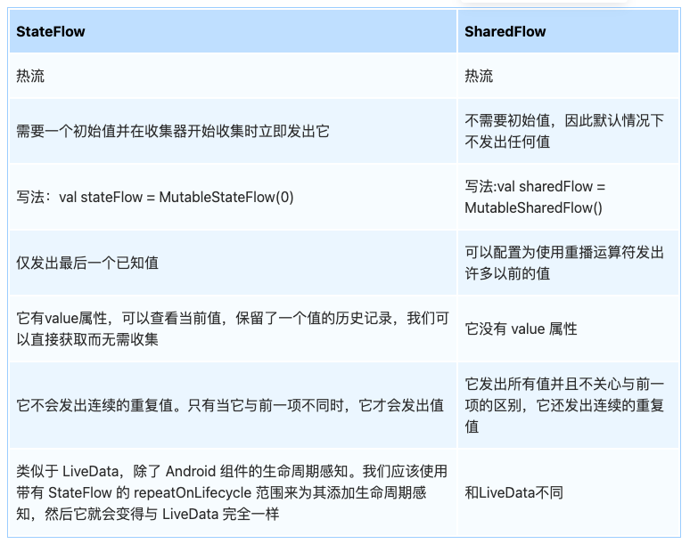

# Kotlin基础知识

- kotlin扩展函数底层原理
- Kotlin inner 关键字
- Kotlin 相对于 Java 有什么优势？
- Kotlin 中的数据类是什么
- 什么是密封类
- Inline CrossLine noLine的区别
- 区分lateinit和 lazy
- 了解过Kotlin的reified关键字么?
- let的原理

1. 数据类
2. 扩展函数
3. 空安全

数据类自动生成的方法：equals、hashCode、copy、toString

**Kotlin中List和Array类型之间有什么区别**

Array适用于固定长度的场景，List适用于动态长度的场景，如果需要频繁添加和删除元素时，可以优先考虑使用 List

Companion Object是伴生对象，Kotlin 的伴生对象通过静态内部类和单例模式实现，既保留了面向对象的特性，又提供了类似 Java 静态成员的访问方式

```kotlin
var marks: Int = someValue
       get() = field
       set(value) {
           field = value
       }
```

lateinit和 lazy

- by lazy { ... }的初始化默认是线程安全的，并且能保证by lazy { ... }代码块中的代码最多被调用一次，而lateinit var默认是不保证线程安全的，它的情况完全取决于使用者的代码。

高阶函数 inline crossInline

1. 若要在 `inline` 函数中返回传入的函数参数，**必须使用 `noinline` 修饰该参数**，否则编译器报错
2. crossInline:修饰 `inline` 函数中的 **某个 Lambda 参数**，要求该 Lambda **必须被内联**，但禁止其内部使用非局部返回（即不允许 `return`）
3. inLIne:修饰高阶函数，表示该函数及其 **所有 Lambda 参数** 的代码会被直接复制到调用处（内联）
4. noinline 非内联*

**双冒号 `::`** 是 Kotlin 的成员引用操作符，用于获取属性或方法的反射引用。

reified:**解决类型擦除**：Java/Kotlin的泛型在编译后会擦除类型信息（如`List<String>`在运行时变为`List`），而`reified`通过结合`inline`函数，使得在运行时仍能获取泛型的具体类型。（在插入的字节码中，使用类型实参的确切类型代替类型实参）

`inline`函数在编译时会将函数体替换到每个调用处，此时泛型类型参数会被替换为实际类型，从而保留具体类型信息。（Kotlin编译器将内联函数的字节码插入到每一次调用方法的地方）

```kotlin
inline fun <reified T> createInstance(): T {
    return T::class.java.newInstance() // 直接通过反射创建实例
}
inline fun <reified T> checkType(obj: Any) {
    if (obj is T) { // 运行时检查类型
        println("对象是 ${T::class.simpleName} 类型")
    }
}
inline fun <reified T : Activity> Context.startActivity() {
    val intent = Intent(this, T::class.java)
    startActivity(intent)
}
```

- **Array 和 IntArray 的区别：** Array 相当于引用类型数组 Integer[]，IntArray 相当于数值类型数组 int[]。

其实 Kotlin 的扩展函数并没有修改原有的 String 类，而是在自己的类中生成了一个静态的方法,当我们在 Kotlin 中调用扩展函数时,编译器将会调用自动生成的函数并且把当前的对象（String）传入。

所有类型.let {} 其实是一个匿名的Lambda表达式，Lambda表达式的特点是，最后一行会自动被认为是返回值类型，所以在表达式返回Boolean

为了保证所有的类型都能正常使用let，给泛型增加了扩展函数let，所以所有的地方都可以使用let函数。

```kotlin
// inline :          是因为函数有lambda表达式，属于高阶函数，高阶函数规范来说要加inline
// <T, R>  T.let :   T代表是要为T而扩展出一个函数名let(任何类型都可以 万能类型.let)， R代表是Lambda表达式最后一行返回的类型
// block: (T) -> R : Lambda表达式名称block 输入参数是T本身  输出参数是R 也就是表达式最后一行返回推断的类型
// : R {           : R代表是Lambda表达式最后一行返回的类型，若表达式返回类型是Boolean, 那么这整个let函数的返回类型就是Boolean
inline fun <T, R> T.let(block: (T) -> R): R {
    println("你${this}.let在${System.currentTimeMillis()}这个时间点调用了我")

    /*contract {
        callsInPlace(block, InvocationKind.EXACTLY_ONCE)
    }*/
    // 调用Lambda表达式
    // 输入参数this == T == "Derry" / 123,
    // 输出参数：用户返回String类型，就全部是返回String类型
    return block(this)
}

```

[谱写Kotlin面试指南三部曲-基础篇](https://juejin.cn/post/7213582722329952312?from=search-suggest#heading-19)

# 委托

- by lazy是如何实现延迟加载的

Lazy`是一个接口，其中包括一个值`value`，即我们在`by lazy{}`中的返回值和一个用来判断当前值是否已经被初始化过的方法`isInitialized()

```kotlin
private class SynchronizedLazyImpl<out T>(initializer: () -> T, lock: Any? = null) : Lazy<T>, Serializable {
    private var initializer: (() -> T)? = initializer
    @Volatile private var _value: Any? = UNINITIALIZED_VALUE
    // final field is required to enable safe publication of constructed instance
    private val lock = lock ?: this

    override val value: T
        get() {
            val _v1 = _value
            if (_v1 !== UNINITIALIZED_VALUE) {
                @Suppress("UNCHECKED_CAST")
                return _v1 as T
            }

            return synchronized(lock) {
                val _v2 = _value
                if (_v2 !== UNINITIALIZED_VALUE) {
                    @Suppress("UNCHECKED_CAST") (_v2 as T)
                } else {
                    val typedValue = initializer!!()
                    _value = typedValue
                    initializer = null
                    typedValue
                }
            }
        }

    override fun isInitialized(): Boolean = _value !== UNINITIALIZED_VALUE
}
```

三种委托（类委托、对象委托和局部变量委托

类委托：基础类和被委托类都实现同一个接口，编译时生成的字节码中，继承自 Base 接口的方法都会委托给基础对象处理。

属性委托：**在每个属性委托的实现的背后，Kotlin 编译器都会生成辅助属性并委托给它。 例如，对于属性 prop，会生成「辅助属性」 prop$delegate。** 而 prop 的 getter() 和 setter() 方法只是简单地委托给辅助属性的 getValue() 和 setValue() 处理。

```kotlin
class Example {
    // 被委托属性
    var prop: String by Delegate() // 基础对象
}

--------------------------------------------------------
编译器生成的字节码：
class Example {
    private val prop$delegate = Delegate()
    // 被委托属性
    var prop: String
        get() = prop$delegate.getValue(this, this:prop)
        set(value : String) = prop$delegate.setValue(this, this:prop, value)
}
```


[by lazy是如何实现延迟加载的](https://www.jianshu.com/p/68962ad7986f)

[委托模式（Delegate）和委托属性（Delegate Properties）](https://www.jianshu.com/p/f54ff17425b2)

[Kotlin学习系列（六）：委托及其原理](https://juejin.cn/post/7016507751094288398)

# 不变：协变和逆变


### 协变应用

- 在 Java 中用通配符 `? extends` 表示协变
- 在 Kotlin 中关键字 `out` 表示协变

### 逆变应用

- 在 Java 中使用通配符 `? super` 表示逆变
- 在 Kotlin 中使用关键字 `in` 表示逆变

为什么协变只能读取泛型，不能修改泛型？

答：因为 例如<Object> = <String> 泛型接收端是Object，而泛型具体端是String，由于具体端有很多很多Object的子类，

而泛型会被泛型擦除，所以无法明确你到底要修改那个子类啊

为什么逆变只能修改泛型，不能读取泛型？

答：因为 例如<String> = <Object>  泛型接收端是String，而泛型具体端是Object，由于接收端是String，而读取时，

会读取到String的父类，但是接收端是String，你却读取到String的父类，这个本来就是不合理的

不变：这个泛型，可以是生产者，也可以是消费者，此泛型没有任何泛型继承相关的概念，可以理解是完全独立出来的泛型

T.() -> R使用

```kotlin
fun String.process(block: String.() -> String): String {
    return block()
}

val result = "Kotlin".process {
    substring(0, 3).uppercase() // 直接操作 String 的方法
}
println(result) // 输出 "KOT"
```


[换个姿势，十分钟拿下Java/Kotlin泛型](https://juejin.cn/post/7133125347905634311)

[「Java 路线」| 关于泛型能问的都在这里了（含Kotlin）](https://juejin.cn/post/6888345234653052941)

# 协程

如何理解协程的挂起和恢复

协程比线程更高效的原因是什么？

CoroutineScope.launch {} 中的异常如何工作

作用域

线程和协程的区别

协程通过suspend来标识挂起点，但真正的挂起点还需要通过是否返回COROUTINE_SUSPEND来判断，而代码体现是通过状态机来处理协程的挂起与恢复。在需要挂起的时候，选保留线程与设置的下一个状态机，然后再通过退出的方式来挂起协程，在挂起的过程中并不会阻塞当前的线程。对应的恢复通过resumewith来进入状态机的下一个状态，同时在进入下一个状态时会恢复之前挂起的现场。

协程的目的是，简化复杂的异步代码逻辑，用同步的代码写出复杂的异步代码

对于*SupervisorJob*其实和协程中的普通Job非常类似，唯一的区别在于如果子协程出现了异常，不会导致父协程以及其他兄弟协程取消关闭。

**协程作用域构建器 coroutineScope、runBlocking、supervisorScope**

- runBlocking是常规函数，会阻塞当前线程；coroutineScope是挂起函数，不会阻塞当前线程

- 它们都会等待协程体以及所有子协程结束，一个是阻塞线程等待，一个是挂起等待
- coroutineScope，一个协程失败了，所有其他兄弟协程也会被取消
- **supervisorScope，一个子协程失败了，不会影响其他兄弟协程**，但如果是作用域有异常失败了，则所有的子协程都会失败退出

suspendCancellableCoroutine写改期函数

启动协程的方式：

1. launch
2. async
3. runBlocking

async执行时机：

- **默认行为**：`async { ... }` 的任务在创建时立即执行，无需等待 `await()`，返回的是*Deferred* 。
- **延迟模式**：通过 `start = CoroutineStart.LAZY` 可延迟执行，直到调用 `await()` 或 `start()`

协程高效的原因

 	1. 协程是轻量级的，占用内存少
 	2. 减少了线程切换的成本，协程可以挂起和恢复，
 	3. 不需要多线程的锁机制：因为只有一个线程，也不存在同时写变量冲突

**异常捕获：**

- `try-catch` 优先级更高**：直接包裹异常代码的 `try-catch` 会先捕获异常。
- **`CoroutineExceptionHandler` 是兜底机制**：处理未被局部捕获的异常。

Default和IO和Main的定义

- **`Dispatchers.Default`**：为 CPU 密集型任务优化，线程数严格限制。
- **`Dispatchers.IO`**：为 I/O 密集型任务优化，允许更多线程阻塞等待。

**Job和SupervisorJob的区别**

ob()返回的是JobImpl对象，SupervisorJob()返回的SupervisorJobImpl对象。而SupervisorJobImpl是JobImpl的子类，并且重写了childCancelled方法，返回值为false。

1. 中间有Job类型启动的协程时，如果子协程发生异常，异常会交由根协程处理。
2. 中间有SupervisorJob类型启动的协程时，如果子协程发生异常，异常会交由子协程处理。

###### SupervisorJob和SupervisorScope

- 使用SupervisorJob时，一个子协程的运行失败不会影响其他的子协程，SupervisorJob不会传播异常给它的父级，它会让子协程自己处理异常
- 或者SupervisorScope中的子协程，一个失败，其他的子协程也不会受影响，但如果是协程作用域里面有异常失败，则所有子协程都会失败退出


[谱写Kotlin面试指南三部曲-协程篇](https://juejin.cn/post/7220235452292137019?searchId=20250313223114825A3383B08722955F7F#heading-11)

[Android面试题之Kotlin协程一文搞定](https://juejin.cn/post/7365771381677654050?searchId=20250313223114825A3383B08722955F7F#heading-15)

[抽丝剥茧聊Kotlin协程之聊聊Job和SupervisorJob的区别](https://juejin.cn/post/7046191497628090399?from=search-suggest#heading-3)

[Android 面试之Kotlin 协程上下文和异常处理](https://juejin.cn/post/7365704546100674612?searchId=2025031417035708FDC73821CD7AD149F2)

# Flow

- StateFlow 和 SharedFlow 之间的区别
- Kotlin Flow如何实现并发？

flowOnLifecycle

冷流：是懒加载的只有开始收集的时候才开始执行逻辑

热流：没有收集器在运行，也能够主动发出数据更新给所有监听者

stateFlow和ShareFlow都是热流，stateFlow保持最新的状态值并允许新订阅者立即收到最新状态；ShareFlow更加灵活，可以根据需求配置重播策略。缓冲区大小等参数

如果你的应用需要维护一个特定的状态并且希望所有订阅者都能获取到最新的状态值，那么`StateFlow`是更好的选择。反之，如果应用需求更多地集中在事件广播上，其中可能包含多个事件并且每个订阅者都可能对不同的事件感兴趣，则应该考虑使用`SharedFlow`

并发实现使用了buffer

**缓存区buffer发生了什么？**

当收集器处理发出的数据时,下一个发射器开始其过程。它不会等待收集器完成它对先前发出的数据的处理并返回控制权。这是通过在单独的协程中运行收集器和发射器来实现的，

SharedFlow、StateFlow与LiveData的区别
StateFlow就是SharedFlow的一种特殊类型，特点有三：

它的replay容量为 1；即可缓存最近的一次粘性事件，如果想避免粘性事件问题，使用SharedFlow，replay默认值0。
初始化时必须给它设置一个初始值
每次发送数据都会与上次缓存的数据作比较，只有不一样才会发送。 它还可直接访问它自己的value参数获取当前结果值，在使用上与LiveData相似。
与LiveData的不同点

StateFlow必须在构建的时候传入初始值，LiveData不需要；
StateFlow默认是防抖的，即相同值不更新，LiveData默认不防抖；
StateFlow默认没有和生命周期绑定

collect和collectLatest有什么区别

- `collect`：适合逐个、顺序处理所有发射的流数据，保证每个值都被完整处理。
- `collectLatest`：适合只关心最新数据的场景，可以中途取消未完成的处理以优先处理最新的发射值。

1. Contact将 **两个 Flow 按顺序连接**，先发射第一个 Flow 的所有元素，再发射第二个 Flow 的元素。
2. Zip将 **两个 Flow 的元素按顺序一一配对**，当两个 Flow 的对应位置元素都到达时，触发合并操作。
3. **`SharedFlow` 缓冲区溢出策略**：根据业务需求选择 `SUSPEND`、`DROP_OLDEST` 或 `DROP_LATEST`，平衡数据完整性和实时性。

```kotlin
fun startLongRunningTask() {
    viewModelScope.launch {
        doLongRunningTaskOne()
            .zip(doLongRunningTaskTwo()) { resultOne, resultTwo ->
                return@zip resultOne + resultTwo
            }
            .flowOn(Dispatchers.Default)
            .catch { e ->
                //异常处理
            }
            .collect {
                //获取结果
                println(it)
            }
    }
}
```

在进行任务重试的时候，操作符是retry和retryWhen





[谱写Kotlin面试指南三部曲-Flow篇](https://juejin.cn/post/7222982459583152188#heading-15)

[Kotlin协程之Flow使用](https://juejin.cn/post/7034381227025465375#heading-1) Flow的操作符介绍

[官方推荐 Flow 取代 LiveData,有必要吗？](https://juejin.cn/post/6986265488275800072)


