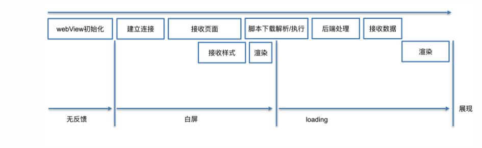

webview优化

- WebView 动态加载和销毁
- 独立的web进程，与主进程隔开，解决任何webview内存泄漏之类的问题
- 实现WebView复用
- DNS解析优化（接口与网页主域名一致）
- 离线预推，下发离线包，并增量更新
- 网页按节点局部刷新
- 自定义实现图片资源缓存
- 加载本地网页



1. 通常情况下，CSS不会阻塞HTML的解析，但如果CSS后面有JS，则会阻塞JS的执行直到CSS加载完成（即便JS是内联的脚本），从而间接阻塞HTML的解析

2. 设置缓存模式 ，防止每次打开H5都要请求网络

   缓存模式是一种 当加载 `H5`网页时 该如何读取之前保存到本地缓存

```cpp
// 缓存模式说明: 
      // LOAD_CACHE_ONLY: 不使用网络，只读取本地缓存数据
      // LOAD_NO_CACHE: 不使用缓存，只从网络获取数据.
      // LOAD_DEFAULT: （默认）根据cache-control决定是否从网络上取数据。
      // LOAD_CACHE_ELSE_NETWORK，只要本地有，无论是否过期，或者no-cache，都使用缓存中的数据
```

3. 资源预加载

   首次加载定义全局WebView对象，后续加载构建自身Webview复用池

4. 自定义构建缓存

   对于H5中一些大图采用本地保存静态资源文件，拦截H5页面的资源网络请求进行替换，同时放倒本地的资源也可以更新

   重写WebViewClient` 的 `shouldInterceptRequest` 方法。

   

   [Carson带你学Android：手把手构建WebView缓存机制及资源预加载方案](https://www.jianshu.com/p/5e7075f4875f)
    [WebView性能、体验分析与优化](https://tech.meituan.com/2017/06/09/webviewperf.html)

   [WebView优化提升H5加载速度方案](https://blog.csdn.net/ljphhj/article/details/103870628)

   [Android WebView最佳优化（WebView池）](https://blog.csdn.net/u011082160/article/details/118245494)

   

   

